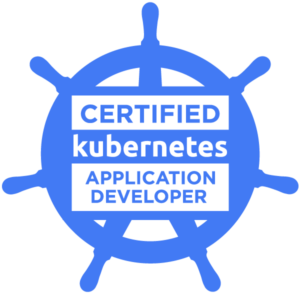
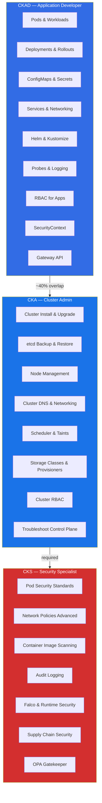
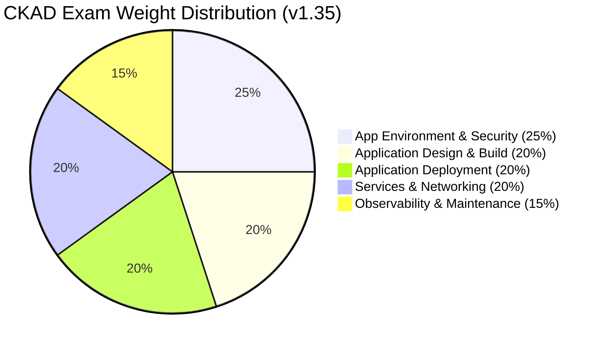
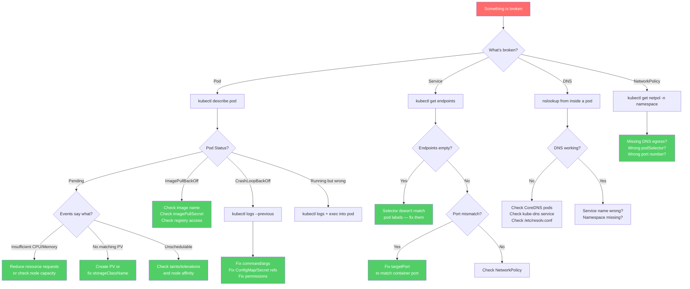

[](https://opensource.org/licenses/MIT)
[](http://makeapullrequest.com)
[](https://github.com/techwithmohamed/CKAD-Certified-Kubernetes-Application-Developer/blob/main)
[](https://github.com/techwithmohamed/CKAD-Certified-Kubernetes-Application-Developer/blob/main)
[](https://github.com/techwithmohamed/CKAD-Certified-Kubernetes-Application-Developer/blob/main)

> My CKAD study notes, practice questions, and kubectl cheat sheet. Kubernetes v1.35. I scored 91% — this is everything I used to prepare.

<p align="center">
  <a href="https://github.com/techwithmohamed/CKAD-Certified-Kubernetes-Application-Developer/stargazers">
    
  </a>
</p>

> **⭐ If this repo helps you pass the CKAD, a star helps other candidates find it.**

# CKAD Certification Guide 2026 — How I Passed with 91%

<p align="center">
  
</p>

I took the CKAD in March 2026 and scored 91%. Writing this while it's fresh — partly because I was frustrated with how many outdated CKAD study guides still floating around (v1.31 references in 2026, really?) and partly because organizing my notes helped me retain what I learned.

The [CKAD (Certified Kubernetes Application Developer)](https://www.cncf.io/certification/ckad/) is a hands-on, terminal-based exam. 2 hours, roughly 15–20 tasks, no multiple choice. I prepped for about 4 weeks. Below are my study notes, the kubectl commands I actually used, YAML I wrote from memory, practice questions, and the mistakes I made along the way.

> Blog version of these notes: [How to Pass the CKAD Exam](https://techwithmohamed.com/blog/ckad-exam-study-guide/)

If this helped you prepare for the CKAD, a star helps other candidates find it.

### Quick Start (< 4 Weeks to Exam)

Short on time? Here's the fast track:

1. **Run the setup script** — `source scripts/exam-setup.sh` to get aliases, vim config, and tab completion
2. **Memorize the skeletons** — skim [`skeletons/`](skeletons/) once, then practice writing each from memory
3. **Do exercises 1, 3, 5, 6, 10, 11** — they cover pods, ConfigMaps, NetworkPolicy, rolling updates, security, and StatefulSets (the highest-weighted domains)
4. **Run the interactive quiz** — `bash scripts/quiz.sh` for timed practice with auto-verification
5. **Take the mock exam below** — 17 questions, 70% weight coverage. Time yourself (5–8 min per question)
6. **Run killer.sh** — do both sessions. Review every wrong answer. Repeat the weak topics
7. **Read [Exam Day Strategy](#exam-day-strategy) and [Common Mistakes](#mistakes-that-will-fail-you)** the night before

If you're on Linux and missing local cluster tools, install them first:

```bash
# kind (recommended)
curl -Lo ./kind https://kind.sigs.k8s.io/dl/latest/kind-linux-amd64
chmod +x ./kind
sudo mv ./kind /usr/local/bin/kind

# minikube (alternative)
curl -LO https://storage.googleapis.com/minikube/releases/latest/minikube-linux-amd64
sudo install minikube-linux-amd64 /usr/local/bin/minikube

# k3d (alternative)
curl -s https://raw.githubusercontent.com/k3d-io/k3d/main/install.sh | bash
```

If you score 80%+ on the mock exam **and** 70%+ on killer.sh, you're ready. Book the exam.

> **Every exercise includes a `verify.sh` script** — run it after you attempt the exercise to auto-check your work: `bash exercises/01-pod-basics/verify.sh`

### Repo Structure

```
README.md                      # This guide
exercises/                     # 14 hands-on labs (one per folder, each with verify.sh)
  01-pod-basics/               # Easy
  02-multi-container-pod/      # Medium
  03-configmap-secret/         # Medium
  04-rbac/                     # Medium
  05-networkpolicy/            # Hard
  06-rolling-update/           # Medium
  07-helm/                     # Medium
  08-probes/                   # Medium
  09-ingress-gateway/          # Hard
  10-security-pvc/             # Hard
  11-statefulset/              # Hard      ← NEW
  12-daemonset/                # Medium    ← NEW
  13-init-containers/          # Medium    ← NEW
  14-in-place-scaling/         # Hard      ← NEW (v1.35 GA feature)
skeletons/                     # 14 bare YAML templates for quick reference
scripts/
  exam-setup.sh                # Aliases + vim config (run first thing)
  quiz.sh                      # Interactive terminal quiz with auto-verification
CONTRIBUTING.md
LICENSE
```

---

## Table of Contents

### Start Here — Practice Your Skills
- [Quick Start (< 4 Weeks to Exam)](#quick-start--4-weeks-to-exam)
- [CKAD Exam Details & Quick Facts](#exam-details)
- [CKAD Syllabus Breakdown (v1.35)](#ckad-syllabus-breakdown-v135)
- [CKAD Domain Weight Distribution](#ckad-domain-weight-distribution)
- [Practice Scenarios with Full Solutions](#practice-scenarios-with-full-solutions)
- [Practice Questions — Full Mock Exam](#practice-questions-mock-exam)
- [Study Progress Tracker](#study-progress-tracker)

### Exam Preparation Strategy
- [What Changed in v1.35 for CKAD](#what-changed-in-v135)
- [Before You Book the CKAD Exam](#before-you-book)
- [The Exam Environment (PSI Remote Desktop)](#the-exam-environment-psi-remote-desktop)
- [First 60 Seconds — Aliases, vim, bash](#first-60-seconds--aliases-vim-bash)
- [Imperative Commands Quick Reference](#imperative-commands-quick-reference)
- [kubectl Cheat Sheet for CKAD](#kubectl-cheat-sheet-for-ckad)
- [Exam Day Strategy — Time Allocation](#exam-day-strategy)
- [Mistakes That Will Fail You on the CKAD](#mistakes-that-will-fail-you)
- [Troubleshooting Decision Flowchart](#troubleshooting-decision-flowchart)
- [CKAD Exam Day Checklist](#exam-day-checklist)

### Study Resources & Planning
- [Docs Pages I Actually Used During the Exam](#docs-pages-i-actually-used-during-the-exam)
- [Study Resources for CKAD 2026](#study-resources)
- [CKAD Study Plan (4-5 Weeks)](#ckad-study-plan-4-5-weeks)
- [killer.sh vs the Real CKAD Exam](#killersh-vs-the-real-exam)

### Exam Details & Reference
- [CKAD Exam Details — Cost, Duration, Passing Score, Format](#exam-details)
- [How Much Does the CKAD Exam Cost?](#how-much-does-the-ckad-exam-cost)
- [CKAD vs CKA vs CKS — Which Certification First?](#ckad-vs-cka-vs-cks--which-certification-should-you-get-first)
- [CKAD vs CKA vs CKS Scope Architecture Diagram](#ckad-vs-cka-vs-cks-scope-architecture-diagram)
- [CKAD FAQ — Common Questions](#faq)

### Final Thoughts
- [YAML Skeletons — Write These from Memory](#yaml-skeletons)
- [Final Words](#final-words)

---

## CKAD Exam Details — Cost, Duration, Passing Score, Format (March 2026)

| **Detail**                      | **Description**                                                                 |
|-------------------------------|---------------------------------------------------------------------------------|
| **Exam Type**               | Performance-based (live terminal — NOT multiple choice)                          |
| **Exam Duration**           | 2 hours                                                                         |
| **Passing Score**           | 66% (one free retake included)                                                  |
| **Kubernetes Version on Exam** | Kubernetes v1.35                                                             |
| **Certification Validity** | 2 years                                                                         |
| **Exam Cost**               | $445 USD — check Linux Foundation site for coupons (30% off codes appear regularly; up to 50% during Black Friday / Cyber Monday) |
| **Exam Delivery**           | PSI Bridge — remote proctored, browser-based                                    |
| **Allowed Resources During Exam** | One browser tab open to kubernetes.io/docs, kubernetes.io/blog, and GitHub kubernetes repos only |
| **Number of Questions**     | ~15–20 performance tasks                                                        |
| **Cluster Contexts**        | Multiple clusters — you must switch context before each task                    |

> **Important:** The Linux Foundation occasionally updates the exam Kubernetes version. Always verify the current version at [training.linuxfoundation.org](https://training.linuxfoundation.org/certification/certified-kubernetes-application-developer-ckad/) before you register.

### How Much Does the CKAD Exam Cost?

The CKAD exam costs $445 USD (as of March 2026). That includes:

- One free retake if you fail (valid 12 months)
- Two killer.sh simulator sessions (each valid 36 hours)

I waited for a Linux Foundation 30% off promotion and saved about $130. They run these a few times a year — check the [training site](https://training.linuxfoundation.org/certification/certified-kubernetes-application-developer-ckad/) for current deals. Black Friday / Cyber Monday discounts can go up to 50%.
Bundle pricing (CKA + CKAD or CKAD + CKS) also knocks 20–30% off.

### CKAD vs CKA vs CKS — Which Certification Should You Get First?

| | **CKAD** | **CKA** | **CKS** |
|---|---|---|---|
| **Focus** | Application development, pod design | Cluster management, troubleshooting | Security hardening, vulnerability scanning |
| **Difficulty** | Medium | Medium-Hard | Hard (requires CKA first) |
| **Duration** | 2 hours | 2 hours | 2 hours |
| **Cost** | $445 | $445 | $445 |
| **Prerequisite** | None | None | Active CKA certification |
| **Best for** | Developers deploying on K8s | DevOps engineers, SREs, platform teams | Security engineers, compliance roles |
| **Typical order** | 1st or 2nd (if you're a dev) | Start here (if you're ops) | 3rd (requires CKA) |

> **Recommendation:** If you build and deploy applications on Kubernetes, CKAD first. If you manage clusters, start with CKA. The ~40% shared content means studying for one makes the other easier. CKS requires an active CKA, so you cannot skip it.



---

## What Changed in v1.35 for CKAD

The CKAD exam runs on Kubernetes v1.35 as of March 2026. Here are the changes relevant to the exam:

| **Feature** | **Status** | **What It Means for CKAD** |
|---|---|---|
| Sidecar Containers | GA (Stable) | Sidecars use `restartPolicy: Always` inside initContainers. They start before the main container and persist for the Pod lifetime. Multi-container Pod questions reference this. |
| In-Place Pod Vertical Scaling | GA (Stable) | Resize CPU/memory of a running Pod without restarting it. Expect resource management tasks using this. |
| OCI Artifact Volumes | Beta (default) | Mount OCI images as read-only volumes. Enabled by default in v1.35. Useful for tooling and init workflows. |
| Gateway API (v1.4+) | Standard | HTTPRoute is the standard. Ingress NGINX is retired (March 2026). Exam questions now favor Gateway API over Ingress. |
| Ingress NGINX Retired | Removed | Ingress NGINX is archived after March 2026. Migrate to Gateway API — know both for the exam but expect Gateway API questions. |
| Fine-Grained Container Restart Rules | Beta | Per-container restartPolicyRules — restart individual containers based on exit codes without recreating the Pod. |
| cgroup v1 Removed | Removed | Kubelet requires cgroup v2. Nodes on old distros without cgroup v2 will fail. |
| KYAML | Beta (default) | Safer YAML subset for Kubernetes — enabled by default. Less ambiguous than standard YAML. |
| Configurable HPA Tolerance | Beta | Set per-resource tolerance for HPA scaling sensitivity instead of the fixed 10% global default. |
| Deployment terminatingReplicas | Beta | New status field showing Pods being terminated — helps with rollout observability. |

When I took the exam in March 2026, I saw Helm, multi-container pod (sidecar), probes, and NetworkPolicy questions. The Ingress NGINX retirement means Gateway API knowledge is no longer optional.

Full changelog: [Kubernetes v1.35 CHANGELOG](https://github.com/kubernetes/kubernetes/blob/master/CHANGELOG/CHANGELOG-1.35.md)

---

## Before You Book the CKAD Exam

I booked my exam two weeks before I was ready because Linux Foundation had a 30% off sale. Here's what I'd suggest before registering:

1. **Get comfortable with vim first.** The exam terminal doesn't support Ctrl+C/Ctrl+V the way you expect. I fumbled with paste on my first question and lost a few minutes. Practice writing YAML by hand.

2. **Do [killer.sh](https://killer.sh/ckad) at least twice.** Two free sessions come with the exam purchase (each valid 36 hours). I scored 52% the first time and 81% a week later. killer.sh is harder than the real exam on purpose.

3. **Use Killercoda for free daily practice.** [killercoda.com](https://killercoda.com) — browser-based Kubernetes playground, no local setup required.

4. **Read the Candidate Handbook.** The Linux Foundation publishes a Candidate Handbook. Understand what IDs are accepted, what you can have in the room, and how the PSI check-in process works before exam day.

5. **Schedule your exam at your best time of day.** I booked mine at 9 AM on a Saturday. If you're a night owl, don't book early morning.

6. **Clean your room the night before.** The proctor asked me to unplug my second monitor and remove a sticky note from my desk before starting. Clear your desk the night before to avoid delays.

7. **Learn where things are in the docs, not just what they say.** You get one tab open to kubernetes.io/docs during the exam. If you've never navigated those pages under pressure, you'll waste time. The Tasks section has the most copy-paste-friendly YAML.

---

## The Exam Environment (PSI Remote Desktop)

The exam runs inside a remote desktop hosted by PSI — a Linux desktop in your browser. Here's the setup:

- You open the PSI Secure Browser on your machine.
- The proctor checks your ID and room via webcam.
- You get dropped into a remote Linux desktop with a terminal and a Firefox browser pointed at kubernetes.io/docs.
- The terminal has access to multiple Kubernetes clusters (usually 4–6 clusters across the questions).
- Every question includes a context switch command like `kubectl config use-context k8s` — run this before you do anything else in that question.

Things that tripped me up:

- **Copy/paste uses `Ctrl+Shift+C` / `Ctrl+Shift+V`** — NOT `Ctrl+C/V`. I hit Ctrl+C thinking I was copying and killed a running process.
- **The connection will lag at some point.** Don't retype the same command — just wait.
- You get one terminal tab by default — try `Ctrl+Alt+T` to open a second one. Having two terminals open saved me on a multi-container pod question.
- `mousepad` is available as a text editor if you hate vim, but honestly just learn vim. Under pressure, fewer tools = fewer mistakes.
- Don't use `tmux` unless you literally use it every day at work. I watched a YouTuber recommend it and wasted time in practice fighting with tmux instead of solving questions.

**Allowed documentation during the exam:**

- kubernetes.io/docs
- kubernetes.io/blog
- GitHub repos under the `kubernetes` organization

That is it. No Stack Overflow, no Medium, no your own notes.

> **Pro tip:** search on kubernetes.io/docs and click the Tasks result, not Concepts. Tasks pages have ready-to-use YAML.

---

## First 60 Seconds — Aliases, vim, bash

Before you touch Question 1, run this setup. It takes about 30 seconds and you'll use these aliases constantly.

```bash
# 1. Set aliases (your best friend for 2 hours)
alias k=kubectl
export do='--dry-run=client -o yaml'
export now='--force --grace-period=0'

# 2. Enable tab completion
source <(kubectl completion bash)
complete -F __start_kubectl k

# 3. Fix vim for YAML editing
cat << 'EOF' >> ~/.vimrc
set expandtab
set tabstop=2
set shiftwidth=2
set number
EOF

# 4. Verify everything works
k get nodes
```

That's it. Don't overthink it. Don't try to set up tmux. Don't customize your bash prompt. Just these 4 steps, then start solving.

This is also available as a script: [`scripts/exam-setup.sh`](scripts/exam-setup.sh) (run it with `source` so aliases stay available)

I practiced this sequence every morning during my study weeks so I could type it without thinking on exam day.

---

## Imperative Commands Quick Reference

Why imperative? Under exam pressure you need speed. Most CKAD questions can be solved faster with imperative commands than writing YAML from scratch. Use `--dry-run=client -o yaml` to generate scaffolds, then edit if needed.

### Fast Pod Creation (30 seconds vs 3 minutes for YAML)

```bash
# Basic pod
k run nginx --image=nginx

# Pod with port
k run nginx --image=nginx --port=80

# Pod with labels
k run nginx --image=nginx --labels=app=web,tier=frontend

# Pod with environment variables
k run nginx --image=nginx --env=LOG_LEVEL=debug --env=APP_ENV=prod

# Pod with command override
k run nginx --image=nginx -- sh -c "echo 'Hello' && sleep 3600"

# Generate YAML without running
k run nginx --image=nginx $do > pod.yaml
```

### Deployment Creation & Management

```bash
# Basic deployment
k create deployment webapp --image=nginx

# Deployment with replicas
k create deployment webapp --image=nginx --replicas=3

# Scale deployment
k scale deployment webapp --replicas=5

# Update image (rolling update)
k set image deployment/webapp nginx=nginx:1.27 --record

# Rollout commands
k rollout status deployment/webapp
k rollout history deployment/webapp
k rollout undo deployment/webapp
k rollout undo deployment/webapp --to-revision=2
```

### Service Exposure

```bash
# Expose as ClusterIP (internal only)
k expose deployment webapp --port=80 --target-port=8080

# Expose as NodePort
k expose deployment webapp --port=80 --target-port=8080 --type=NodePort

# Expose as LoadBalancer
k expose deployment webapp --port=80 --target-port=8080 --type=LoadBalancer

# Generate service YAML for editing
k expose deployment webapp --port=80 $do > svc.yaml
```

### ConfigMap & Secrets

```bash
# Create ConfigMap from literals
k create configmap app-config --from-literal=LOG_LEVEL=debug --from-literal=DB_HOST=postgres

# Create ConfigMap from file
k create configmap app-config --from-file=config.properties

# Create Secret from literals
k create secret generic db-secret --from-literal=username=admin --from-literal=password=secret123

# Create Secret from file
k create secret generic tls-secret --from-file=tls.crt=cert.pem --from-file=tls.key=key.pem

# Generate as YAML
k create configmap app-config --from-literal=key=value $do > cm.yaml
```

### RBAC

```bash
# Create ServiceAccount
k create sa my-app -n prod

# Create Role
k create role pod-reader --verb=get,list,watch --resource=pods -n prod

# Create RoleBinding
k create rolebinding read-pods --role=pod-reader --serviceaccount=prod:my-app -n prod

# Create ClusterRole
k create clusterrole node-reader --verb=get,list --resource=nodes

# Create ClusterRoleBinding
k create clusterrolebinding read-nodes --clusterrole=node-reader --serviceaccount=prod:my-app

# Check permissions
k auth can-i list pods -n prod --as=system:serviceaccount:prod:my-app
```

> **Exam tip:** Use `$do` to generate YAML, review it, then apply. Never type full manifests from memory under time pressure.

---

## Docs Pages I Actually Used During the Exam

You can't bookmark in the exam browser, but you can memorize where things are. These are the kubernetes.io pages I actually used during the exam:

| **Topic** | **How to Find It** | **Why It's Useful** |
|---|---|---|
| Pod YAML | Search: `pod` → Tasks > Configure Pods | Basic pod spec with volumes, env, etc. |
| Multi-container Pod / Sidecar | Search: `sidecar` → first result | The `restartPolicy: Always` initContainer syntax |
| Deployment + Rolling Update | Search: `deployment` → Concepts > Deployments | Strategy, maxSurge, maxUnavailable examples |
| CronJob YAML | Search: `cronjob` → Tasks result | Complete CronJob spec with schedule |
| ConfigMap | Search: `configmap` → Tasks > Configure Pods to use ConfigMaps | env, envFrom, and volume mount examples |
| Secret | Search: `secret` → Tasks > Secrets | Creating and consuming secrets |
| Probes | Search: `liveness` → Tasks > Configure Liveness, Readiness Probes | httpGet, exec, tcpSocket probe examples |
| NetworkPolicy YAML | Search: `network policy` → Tasks result | Ingress + egress + DNS egress ready to copy |
| Service Types | Search: `service` → Concepts > Service | ClusterIP, NodePort, LoadBalancer |
| Ingress | Search: `ingress` → Concepts > Ingress | TLS + path-based routing examples |
| Gateway API HTTPRoute | Search: `gateway api` → or go to gateway-api.sigs.k8s.io | GatewayClass + Gateway + HTTPRoute examples |
| RBAC | Search: `rbac` → Using RBAC Authorization | Role, ClusterRole, bindings |
| PV / PVC | Search: `persistent volume` → Tasks > Configure a Pod to Use a PersistentVolume | Complete PV → PVC → Pod chain |
| SecurityContext | Search: `security context` → Tasks result | runAsUser, capabilities, drop ALL |
| Resource Quotas | Search: `resource quota` → first result | LimitRange + ResourceQuota YAML |
| Helm | Search: `helm` or go directly to helm.sh/docs | install, upgrade, rollback, show values |
| kubectl Cheat Sheet | Search: `cheat sheet` → first result | All the imperative commands |

> The Tasks section usually has better copy-paste YAML than Concepts.

---

## kubectl Cheat Sheet

These aliases save a lot of typing. Set them up in the first 30 seconds of the exam.

### Step 1 — Set Aliases and Environment (type this first thing)

```bash
alias k=kubectl
export do='--dry-run=client -o yaml'
export now='--force --grace-period=0'
source <(kubectl completion bash)
complete -F __start_kubectl k
```

Now `k get pods -A` works, and `k delete pod mypod $now` kills pods instantly without the 30-second wait.

### Step 2 — Configure vim for YAML

```bash
cat << 'EOF' >> ~/.vimrc
set expandtab
set tabstop=2
set shiftwidth=2
set number
EOF
```

Without this, a single Tab key in vim breaks YAML indentation. This is one of the most common silent failures — your YAML looks right but fails with an indentation error.

### Step 3 — Know How to Generate YAML Without Typing It

```bash
# Pod
k run nginx --image=nginx $do > pod.yaml

# Deployment
k create deployment nginx --image=nginx --replicas=3 $do > deploy.yaml

# Service (expose existing deployment)
k expose deployment nginx --port=80 $do > svc.yaml

# ConfigMap
k create configmap app-cfg --from-literal=ENV=prod $do > cm.yaml

# Secret
k create secret generic app-sec --from-literal=password=1234 $do > sec.yaml

# ServiceAccount
k create serviceaccount app-sa $do > sa.yaml

# Role
k create role pod-reader --verb=get,list,watch --resource=pods $do > role.yaml

# RoleBinding
k create rolebinding bind-reader --role=pod-reader --serviceaccount=default:app-sa $do > rb.yaml

# Job
k create job hello --image=busybox -- echo hello $do > job.yaml

# CronJob
k create cronjob hello --image=busybox --schedule="*/1 * * * *" -- echo hello $do > cj.yaml
```

You generate the scaffold, edit the 2–3 fields you need, then `k apply -f`. This is 10x faster than writing YAML from scratch.

### Other kubectl Commands You'll Use

```bash
# Context management — run BEFORE every question
kubectl config use-context <context-name>
kubectl config current-context

# Explore what a field means
kubectl explain pod.spec.containers.resources
kubectl explain pod.spec --recursive | grep -A 3 tolerations

# Watch pods in real-time
kubectl get pods -w

# Get all resources in all namespaces
kubectl get all -A

# Get events sorted by time (best for debugging)
kubectl get events --sort-by='.lastTimestamp' -n <namespace>

# Force delete a stuck pod immediately
kubectl delete pod stuck-pod --force --grace-period=0

# Port forward to test a service
kubectl port-forward svc/my-service 8080:80

# Resource usage (requires metrics-server)
kubectl top pods --sort-by=cpu
kubectl top nodes

# Label operations
kubectl label pod mypod app=web
kubectl get pods -l app=web
```

---

## CKAD Syllabus Breakdown (v1.35)

## CKAD Domain Weight Distribution

This follows the [official CKAD Curriculum v1.35](https://github.com/cncf/curriculum/blob/master/CKAD_Curriculum_v1.35.pdf). Application Environment, Configuration & Security (25%) and the two 20% domains make up the bulk of the exam. I spent most of my study time on those.

### Domain Weight Map



| **Domain** | **Key Concepts** | **Weight** |
|--------------|---------------------|---------------|
| [**Application Design and Build**](#1-application-design-and-build-20) | Container images, workload resources, multi-container pods, volumes | **20%** |
| [**Application Deployment**](#2-application-deployment-20) | Blue/green, canary, rolling updates, Helm, Kustomize | **20%** |
| [**Application Observability and Maintenance**](#3-application-observability-and-maintenance-15) | API deprecations, probes, monitoring, logs, debugging | **15%** |
| [**Application Environment, Configuration, and Security**](#4-application-environment-configuration-and-security-25) | CRDs, RBAC, requests/limits, ConfigMaps, Secrets, ServiceAccounts, SecurityContexts | **25%** |
| [**Services & Networking**](#5-services-and-networking-20) | NetworkPolicies, Services, Ingress, Gateway API | **20%** |

> App Environment & Security + either Design or Networking = 45% of the exam. If you're short on time, focus on those.

---

### 1. Application Design and Build (20%)

20% of the exam. Covers container images, workload types, multi-container pods, and volumes. If you've used Docker before, most of this will feel familiar.

#### 1.1 — Define, Build, and Modify Container Images

You need to know how to package an app into a container image. The exam may ask you to write or edit a Dockerfile.

```Dockerfile
FROM nginx:alpine
COPY index.html /usr/share/nginx/html/index.html
```

```bash
docker build -t your-dockerhub-username/custom-nginx:latest .
docker push your-dockerhub-username/custom-nginx:latest
```

Deploy it:

```yaml
apiVersion: apps/v1
kind: Deployment
metadata:
  name: custom-nginx
spec:
  replicas: 2
  selector:
    matchLabels:
      app: nginx
  template:
    metadata:
      labels:
        app: nginx
    spec:
      containers:
      - name: nginx
        image: your-dockerhub-username/custom-nginx:latest
```

```bash
kubectl apply -f deployment.yaml
```

[Kubernetes: Container Images](https://kubernetes.io/docs/concepts/containers/images/)

---

#### 1.2 — Choose and Use the Right Workload Resource

Different workloads solve different problems:

- **Deployment**: scalable, stateless apps
- **DaemonSet**: one pod per node (logging agents, monitoring)
- **Job**: run-to-completion tasks
- **CronJob**: scheduled Jobs
- **StatefulSet**: stateful apps needing stable identity and persistent storage

CronJob example — run a backup every night at 2 AM:

```yaml
apiVersion: batch/v1
kind: CronJob
metadata:
  name: backup-job
spec:
  schedule: "0 2 * * *"
  jobTemplate:
    spec:
      template:
        spec:
          containers:
          - name: backup
            image: busybox
            args:
            - "/bin/sh"
            - "-c"
            - "echo Backup complete"
          restartPolicy: OnFailure
```

Job example:

```bash
k create job hello --image=busybox -- echo hello $do > job.yaml
k apply -f job.yaml
k get jobs
k logs job/hello
```

[Kubernetes: Workloads Overview](https://kubernetes.io/docs/concepts/workloads/)

---

#### 1.3 — Understand Multi-Container Pod Design Patterns

Sometimes your Pod needs more than one container. The three patterns to know:

**Init container** (runs before main container starts):

```yaml
spec:
  initContainers:
  - name: init-db
    image: busybox
    command: ['sh', '-c', 'until nslookup mysql; do echo waiting; sleep 2; done']
  containers:
  - name: app
    image: myapp:v1
```

**Sidecar container** (GA since v1.33 — uses `restartPolicy: Always` inside initContainers):

```yaml
spec:
  initContainers:
  - name: log-sidecar
    image: fluentd:v1.16
    restartPolicy: Always    # This makes it a sidecar — starts before main, runs for Pod lifetime
  containers:
  - name: app
    image: myapp:v1
```

**Classic multi-container Pod** (sidecar logging with shared volume):

```yaml
apiVersion: v1
kind: Pod
metadata:
  name: sidecar-example
spec:
  containers:
  - name: main-app
    image: busybox
    command: ["sh", "-c", "while true; do echo $(date) >> /var/log/app.log; sleep 5; done"]
    volumeMounts:
    - name: log-volume
      mountPath: /var/log
  - name: sidecar
    image: busybox
    command: ["sh", "-c", "tail -f /var/log/app.log"]
    volumeMounts:
    - name: log-volume
      mountPath: /var/log
  volumes:
  - name: log-volume
    emptyDir: {}
```

**Ephemeral containers** (for debugging — stable since v1.33):

```bash
# Attach a debug container to a running pod
kubectl debug -it pod/myapp --image=busybox --target=app

# Create a copy with a debug container
kubectl debug pod/myapp -it --copy-to=debug-pod --image=ubuntu --share-processes
```

[Pod Design Patterns](https://kubernetes.io/docs/concepts/workloads/pods/)

---

#### 1.4 — Use Persistent and Ephemeral Volumes

Know when to use `emptyDir` (temporary, dies with the Pod) vs `PersistentVolumeClaim` (data survives Pod restarts).

PVC example:

```yaml
apiVersion: v1
kind: PersistentVolumeClaim
metadata:
  name: pvc-example
spec:
  accessModes:
  - ReadWriteOnce
  resources:
    requests:
      storage: 1Gi
```

Pod mounting the PVC:

```yaml
apiVersion: v1
kind: Pod
metadata:
  name: pod-with-pvc
spec:
  containers:
  - name: app-container
    image: nginx
    volumeMounts:
    - mountPath: /usr/share/nginx/html
      name: storage
  volumes:
  - name: storage
    persistentVolumeClaim:
      claimName: pvc-example
```

Common volume types you should know:

```yaml
# emptyDir — shared temp storage between containers (lost when pod dies)
volumes:
- name: cache
  emptyDir: {}

# hostPath — mounts a path from the node (use carefully)
volumes:
- name: host-logs
  hostPath:
    path: /var/log
    type: Directory

# configMap as volume
volumes:
- name: config
  configMap:
    name: app-config

# secret as volume
volumes:
- name: certs
  secret:
    secretName: tls-secret
```

```bash
kubectl apply -f pvc.yaml
kubectl apply -f pod.yaml
kubectl get pvc
```

[Persistent Volumes](https://kubernetes.io/docs/concepts/storage/persistent-volumes/) | [Ephemeral Volumes](https://kubernetes.io/docs/concepts/storage/volumes/#emptydir)

---

### 2. Application Deployment (20%)

20% of the exam. Covers deployment strategies, rolling updates, Helm, and Kustomize. The Helm and rolling update questions were the quickest points for me.

#### 2.1 — Blue/Green and Canary Deployments

Kubernetes doesn't have built-in blue/green or canary strategies, but you can implement them with labels, selectors, and Services.

**Blue/Green** — create separate deployments and toggle traffic with the Service selector:

```yaml
# blue-deployment.yaml
apiVersion: apps/v1
kind: Deployment
metadata:
  name: blue-deployment
spec:
  replicas: 2
  selector:
    matchLabels:
      app: my-app
      version: blue
  template:
    metadata:
      labels:
        app: my-app
        version: blue
    spec:
      containers:
      - name: app
        image: my-app:blue
```

```yaml
# green-deployment.yaml
apiVersion: apps/v1
kind: Deployment
metadata:
  name: green-deployment
spec:
  replicas: 2
  selector:
    matchLabels:
      app: my-app
      version: green
  template:
    metadata:
      labels:
        app: my-app
        version: green
    spec:
      containers:
      - name: app
        image: my-app:green
```

```yaml
# switch Service to green
apiVersion: v1
kind: Service
metadata:
  name: my-app-svc
spec:
  selector:
    app: my-app
    version: green  # switch this to toggle traffic
  ports:
  - port: 80
    targetPort: 8080
```

**Canary** — roll out a small number of replicas with the new version:

```yaml
apiVersion: apps/v1
kind: Deployment
metadata:
  name: canary
spec:
  replicas: 1
  selector:
    matchLabels:
      app: my-app
      version: canary
  template:
    metadata:
      labels:
        app: my-app
        version: canary
    spec:
      containers:
      - name: app
        image: my-app:canary
```

```bash
kubectl apply -f canary-deployment.yaml
kubectl scale deployment canary --replicas=3
```

[Deployments](https://kubernetes.io/docs/concepts/workloads/controllers/deployment/)

---

#### 2.2 — Rolling Updates and Rollbacks

Zero-downtime updates and quick rollbacks — know these commands cold:

```bash
# Create a deployment
k create deployment webapp --image=nginx:1.24 --replicas=3

# Update the image (triggers rolling update)
k set image deployment/webapp nginx=nginx:1.25

# Check rollout status
k rollout status deployment/webapp

# View rollout history
k rollout history deployment/webapp

# Rollback to previous version
k rollout undo deployment/webapp

# Rollback to a specific revision
k rollout undo deployment/webapp --to-revision=2

# Scale
k scale deployment/webapp --replicas=5
```

Deployment strategy in YAML:

```yaml
apiVersion: apps/v1
kind: Deployment
metadata:
  name: webapp
spec:
  replicas: 3
  strategy:
    type: RollingUpdate
    rollingUpdate:
      maxSurge: 1
      maxUnavailable: 0
  selector:
    matchLabels:
      app: webapp
  template:
    metadata:
      labels:
        app: webapp
    spec:
      containers:
      - name: webapp
        image: nginx:1.25
        resources:
          requests:
            cpu: 100m
            memory: 128Mi
          limits:
            cpu: 250m
            memory: 256Mi
```

---

#### 2.3 — Use Helm for Reusable Application Charts

Helm lets you install, upgrade, and manage apps from packaged charts.

```bash
# Add a repository
helm repo add bitnami https://charts.bitnami.com/bitnami
helm repo update

# Search for a chart
helm search repo bitnami/nginx

# Install a release
helm install my-release bitnami/nginx

# List installed releases
helm list
helm list -A    # all namespaces

# Upgrade a release with new values
helm upgrade my-release bitnami/nginx --set replicaCount=3

# Rollback to previous revision
helm rollback my-release 1

# Uninstall
helm uninstall my-release

# Show chart values (useful during exam)
helm show values bitnami/nginx
```

[Helm Docs](https://helm.sh/docs/)

---

#### 2.4 — Use Kustomize to Patch Configs

Kustomize lets you layer manifest configurations without templates. It's built into kubectl.

**Base Deployment:**

```yaml
# base/deployment.yaml
apiVersion: apps/v1
kind: Deployment
metadata:
  name: kustom-demo
spec:
  replicas: 2
  selector:
    matchLabels:
      app: demo
  template:
    metadata:
      labels:
        app: demo
    spec:
      containers:
      - name: app
        image: my-app:v1
```

**Overlay Patch:**

```yaml
# overlays/prod/kustomization.yaml
resources:
  - ../../base
patchesStrategicMerge:
  - patch.yaml
```

```yaml
# overlays/prod/patch.yaml
apiVersion: apps/v1
kind: Deployment
metadata:
  name: kustom-demo
spec:
  replicas: 5
```

```bash
# Apply with Kustomize
kubectl apply -k overlays/prod/

# Preview what Kustomize generates
kubectl kustomize ./base/
```

[Kustomize Docs](https://kubernetes.io/docs/tasks/manage-kubernetes-objects/kustomization/)

---

### 3. Application Observability and Maintenance (15%)

15% of the exam. Covers probes, logging, monitoring, API deprecations, and debugging. I found these questions relatively quick if you know your `kubectl` commands. Check the [common mistakes section](#mistakes-that-will-fail-you) — forgetting to set the right namespace is a classic way to lose points here.

#### 3.1 — Recognize API Deprecations

Kubernetes APIs get deprecated across versions. Know how to detect and fix deprecated API versions in manifests.

```bash
kubectl convert -f deployment-v1beta1.yaml --output-version=apps/v1
kubectl get events --all-namespaces | grep -i deprecated
```

[K8s API Deprecation Policy](https://kubernetes.io/docs/reference/using-api/deprecation-policy/)

---

#### 3.2 — Use Liveness, Readiness, and Startup Probes

Probes tell Kubernetes whether your app is healthy and ready to receive traffic.

- **Liveness**: is the container alive? If it fails, kubelet restarts the container.
- **Readiness**: is the container ready to serve traffic? If it fails, the pod is removed from Service endpoints.
- **Startup**: for slow-starting containers — prevents liveness probe from killing the app before it starts.

```yaml
livenessProbe:
  httpGet:
    path: /healthz
    port: 8080
  initialDelaySeconds: 5
  periodSeconds: 10
readinessProbe:
  httpGet:
    path: /readyz
    port: 8080
  initialDelaySeconds: 5
  periodSeconds: 10
startupProbe:
  httpGet:
    path: /healthz
    port: 8080
  failureThreshold: 30
  periodSeconds: 10
```

Other probe types:

```yaml
# exec probe — runs a command inside the container
livenessProbe:
  exec:
    command:
    - cat
    - /tmp/healthy

# tcpSocket probe — checks if a port is open
readinessProbe:
  tcpSocket:
    port: 3306
```

```bash
kubectl describe pod <pod-name>   # check probe status in Events
```

[Probe Configuration Guide](https://kubernetes.io/docs/tasks/configure-pod-container/configure-liveness-readiness-startup-probes/)

---

#### 3.3 — Monitor Resources with Built-in CLI Tools

```bash
kubectl top nodes
kubectl top pods
kubectl top pods --sort-by=cpu
kubectl top pods -A --sort-by=memory    # all namespaces
kubectl describe pod <pod-name>
kubectl get events --sort-by='.lastTimestamp' --all-namespaces
```

[Monitoring Tools Overview](https://kubernetes.io/docs/tasks/debug/debug-cluster/)

---

#### 3.4 — Access and Stream Container Logs

Logs are your first stop when something breaks.

```bash
kubectl logs <pod-name>
kubectl logs -f <pod-name>                       # follow/stream logs
kubectl logs <pod-name> -c <container-name>      # specific container in multi-container pod
kubectl logs <pod-name> --previous               # previous crash logs (critical for CrashLoopBackOff)
kubectl logs -l app=webapp --all-containers      # all pods with label
```

[Kubernetes Logging Basics](https://kubernetes.io/docs/concepts/cluster-administration/logging/)

---

#### 3.5 — Perform Interactive Debugging

Sometimes you need to exec into a Pod or attach a debug container.

```bash
kubectl exec -it <pod-name> -- /bin/sh
kubectl get pod <pod-name> -o yaml
kubectl debug -it pod/myapp --image=busybox --target=app
kubectl debug pod/myapp -it --copy-to=debug-pod --image=ubuntu --share-processes
```

Systematic debugging approach (use this on every troubleshooting question):

```bash
# Step 1: Check the pod status
k get pods -n <namespace> -o wide

# Step 2: Describe the pod (events section reveals the cause 90% of the time)
k describe pod <pod-name> -n <namespace>

# Step 3: Check logs
k logs <pod-name> -n <namespace>
k logs <pod-name> -n <namespace> --previous   # if CrashLoopBackOff

# Step 4: Check events
k get events --sort-by='.lastTimestamp' -n <namespace>

# Step 5: Exec into the pod if it's running
k exec -it <pod-name> -n <namespace> -- /bin/sh
```

Common pod failure states and what to check:

| **Status** | **Likely Cause** | **What to Check** |
|---|---|---|
| Pending | Insufficient resources, no matching PV | Check describe for events; check node capacity |
| ImagePullBackOff | Wrong image name, private registry | Fix image name; create imagePullSecret |
| CrashLoopBackOff | App crashing at startup, wrong command/args | Check `logs --previous`; fix command/config |
| CreateContainerError | Missing ConfigMap/Secret, volume mount issue | Verify referenced resources exist |
| OOMKilled | Container exceeded memory limit | Increase memory limit |

[Debugging Guide](https://kubernetes.io/docs/tasks/debug/)

---

### 4. Application Environment, Configuration, and Security (25%)

25% — the heaviest section. I got questions on RBAC, ConfigMaps, Secrets, and SecurityContexts. I spent more time studying this domain than any other. See also the [exam tips section](#exam-day-strategy) for how I prioritized questions by weight.

#### 4.1 — Discover and Use Resources that Extend Kubernetes (CRDs, Operators)

Custom Resource Definitions (CRDs) and Operators let you add new API types to Kubernetes or automate app management.

```bash
# List existing CRDs in the cluster
kubectl get crds

# Describe a CRD
kubectl describe crd <crd-name>

# Get custom resources
kubectl get <custom-resource-kind>
```

Create a CRD:

```yaml
apiVersion: apiextensions.k8s.io/v1
kind: CustomResourceDefinition
metadata:
  name: widgets.example.com
spec:
  group: example.com
  names:
    kind: Widget
    plural: widgets
    singular: widget
    shortNames:
    - wg
  scope: Namespaced
  versions:
  - name: v1
    served: true
    storage: true
    schema:
      openAPIV3Schema:
        type: object
        properties:
          spec:
            type: object
            properties:
              size:
                type: string
              color:
                type: string
```

Create a custom resource instance:

```yaml
apiVersion: example.com/v1
kind: Widget
metadata:
  name: my-widget
spec:
  size: large
  color: blue
```

On the exam you may need to:

- Create custom resources from an existing CRD
- Inspect CRDs with `kubectl get crds` and `kubectl describe`
- Install an operator via `kubectl apply -f` or Helm

[CRDs Overview](https://kubernetes.io/docs/tasks/extend-kubernetes/custom-resources/)

---

#### 4.2 — Understand Authentication, Authorization, and Admission Control

RBAC controls who can do what. On killer.sh I used `ClusterRole` in a `roleRef` but forgot you can bind a ClusterRole with a RoleBinding to scope it to a namespace.

Core concepts:

- **Role**: grants permissions within a single namespace
- **ClusterRole**: grants permissions cluster-wide (or can be bound per-namespace with RoleBinding)
- **RoleBinding**: binds a Role or ClusterRole to a user/group/serviceaccount in a namespace
- **ClusterRoleBinding**: binds a ClusterRole cluster-wide

```yaml
# Role — allow read access to pods in "dev" namespace
apiVersion: rbac.authorization.k8s.io/v1
kind: Role
metadata:
  name: pod-reader
  namespace: dev
rules:
- apiGroups: [""]
  resources: ["pods"]
  verbs: ["get", "list", "watch"]
---
# RoleBinding — bind the Role to a ServiceAccount
apiVersion: rbac.authorization.k8s.io/v1
kind: RoleBinding
metadata:
  name: read-pods-binding
  namespace: dev
subjects:
- kind: ServiceAccount
  name: app-sa
  namespace: dev
roleRef:
  kind: Role
  name: pod-reader
  apiGroup: rbac.authorization.k8s.io
```

Quick imperative commands:

```bash
# Create a Role
k create role pod-reader --verb=get,list,watch --resource=pods -n dev

# Create a RoleBinding
k create rolebinding read-pods --role=pod-reader --serviceaccount=dev:app-sa -n dev

# Check if a ServiceAccount can do something
k auth can-i list pods --as=system:serviceaccount:dev:app-sa -n dev

# Check which roles exist
k get roles,rolebindings -n dev
```

[RBAC Docs](https://kubernetes.io/docs/reference/access-authn-authz/rbac/)

---

#### 4.3 — Understand Requests, Limits, and Quotas

Resource constraints matter. Set them per container and per namespace.

```yaml
resources:
  requests:        # scheduler uses this to find a node
    cpu: "250m"
    memory: "64Mi"
  limits:          # kubelet enforces this ceiling
    cpu: "500m"
    memory: "128Mi"
```

- **requests**: minimum guaranteed resources — scheduler uses requests to decide where to place the pod
- **limits**: maximum allowed — exceeding memory limit → OOMKilled, exceeding CPU → throttled
- A pod stays Pending if no node has enough allocatable resources to satisfy its requests

LimitRange (set defaults per namespace):

```yaml
apiVersion: v1
kind: LimitRange
metadata:
  name: default-limits
  namespace: dev
spec:
  limits:
  - default:
      cpu: 500m
      memory: 256Mi
    defaultRequest:
      cpu: 100m
      memory: 128Mi
    type: Container
```

ResourceQuota (cap total usage per namespace):

```yaml
apiVersion: v1
kind: ResourceQuota
metadata:
  name: compute-quota
spec:
  hard:
    pods: "10"
    requests.cpu: "4"
    requests.memory: "2Gi"
    limits.cpu: "8"
    limits.memory: "4Gi"
```

[Resource Quotas](https://kubernetes.io/docs/concepts/policy/resource-quotas/)

---

#### 4.4 — Use ConfigMaps and Secrets to Configure Applications

**ConfigMap:**

```bash
# From literal
k create configmap app-config --from-literal=DB_HOST=mysql --from-literal=DB_PORT=3306

# From file
k create configmap nginx-conf --from-file=nginx.conf
```

```yaml
# Use ConfigMap as env variables
spec:
  containers:
  - name: app
    image: myapp:v1
    envFrom:
    - configMapRef:
        name: app-config
    # Or individual keys:
    env:
    - name: DATABASE_HOST
      valueFrom:
        configMapKeyRef:
          name: app-config
          key: DB_HOST
```

**Secret:**

```bash
k create secret generic db-creds --from-literal=username=admin --from-literal=password=s3cret
```

```yaml
# Mount Secret as a volume
spec:
  containers:
  - name: app
    image: myapp:v1
    volumeMounts:
    - name: secret-vol
      mountPath: /etc/secrets
      readOnly: true
  volumes:
  - name: secret-vol
    secret:
      secretName: db-creds
```

```yaml
# Or as env:
env:
- name: DB_USERNAME
  valueFrom:
    secretKeyRef:
      name: db-creds
      key: username
```

[ConfigMaps Guide](https://kubernetes.io/docs/concepts/configuration/configmap/) | [Secrets Overview](https://kubernetes.io/docs/concepts/configuration/secret/)

---

#### 4.5 — Understand ServiceAccounts

ServiceAccounts bind Pods to identities that control what they can access in the Kubernetes API.

```bash
kubectl create serviceaccount app-bot
```

```yaml
spec:
  serviceAccountName: app-bot
```

[ServiceAccounts](https://kubernetes.io/docs/tasks/configure-pod-container/configure-service-account/)

---

#### 4.6 — Understand Application Security (SecurityContexts, Capabilities)

Use SecurityContexts to run containers as non-root, drop privileges, and control file permissions.

```yaml
apiVersion: v1
kind: Pod
metadata:
  name: secure-pod
spec:
  securityContext:
    runAsUser: 1000
    runAsGroup: 3000
    fsGroup: 2000
  containers:
  - name: app
    image: nginx
    securityContext:
      allowPrivilegeEscalation: false
      readOnlyRootFilesystem: true
      capabilities:
        drop: ["ALL"]
        add: ["NET_BIND_SERVICE"]
```

[Security Contexts](https://kubernetes.io/docs/tasks/configure-pod-container/security-context/)

---

### 5. Services and Networking (20%)

Networking was my weak spot. I got every NetworkPolicy question wrong on my first killer.sh attempt — usually because of a single indent breaking the policy. I ended up writing NetworkPolicies by hand repeatedly until the YAML stuck. For practice, see the [study resources section](#study-resources).

#### 5.1 — Understand and Write NetworkPolicies

NetworkPolicies control traffic flow between pods. By default, all pods accept all traffic. A NetworkPolicy acts as a firewall.

```yaml
# Allow traffic to "api" pods only from "frontend" pods on port 8080
apiVersion: networking.k8s.io/v1
kind: NetworkPolicy
metadata:
  name: api-allow-frontend
  namespace: production
spec:
  podSelector:
    matchLabels:
      app: api
  policyTypes:
  - Ingress
  - Egress
  ingress:
  - from:
    - podSelector:
        matchLabels:
          app: frontend
    ports:
    - protocol: TCP
      port: 8080
  egress:
  - to:
    - podSelector:
        matchLabels:
          app: database
    ports:
    - protocol: TCP
      port: 5432
  - to:                    # Allow DNS
    - namespaceSelector: {}
    ports:
    - protocol: UDP
      port: 53
```

Default deny all ingress in a namespace:

```yaml
apiVersion: networking.k8s.io/v1
kind: NetworkPolicy
metadata:
  name: default-deny-ingress
  namespace: production
spec:
  podSelector: {}
  policyTypes:
  - Ingress
```

> **Critical:** Always allow DNS egress (port 53 UDP) in your NetworkPolicies, otherwise pods cannot resolve service names. This is the #1 NetworkPolicy gotcha on the exam.

[NetworkPolicy Docs](https://kubernetes.io/docs/concepts/services-networking/network-policies/)

---

#### 5.2 — Use ClusterIP, NodePort, LoadBalancer Service Types

```yaml
# ClusterIP (default — internal only)
apiVersion: v1
kind: Service
metadata:
  name: backend-svc
spec:
  type: ClusterIP
  selector:
    app: backend
  ports:
  - port: 80
    targetPort: 8080
---
# NodePort (exposes on every node's IP at a static port)
apiVersion: v1
kind: Service
metadata:
  name: webapp-nodeport
spec:
  type: NodePort
  selector:
    app: webapp
  ports:
  - port: 80
    targetPort: 8080
    nodePort: 30080    # Range: 30000-32767
```

Imperative:

```bash
k expose deployment webapp --type=NodePort --port=80 --target-port=8080 --name=webapp-np
```

Verify and troubleshoot:

```bash
k get svc
k get endpoints <service-name>           # Empty → selector doesn't match pod labels
k describe svc <service-name>
k exec -it <pod-name> -- curl http://my-app-svc
```

[Service Types Explained](https://kubernetes.io/docs/concepts/services-networking/service/)

---

#### 5.3 — Use Ingress Rules to Expose Applications

Ingress provides HTTP(S) routing to services. Note that Ingress NGINX was retired in March 2026 — Gateway API is now preferred, but Ingress is still in the curriculum.

```yaml
apiVersion: networking.k8s.io/v1
kind: Ingress
metadata:
  name: app-ingress
  annotations:
    nginx.ingress.kubernetes.io/rewrite-target: /
spec:
  ingressClassName: nginx
  rules:
  - host: app.example.com
    http:
      paths:
      - path: /api
        pathType: Prefix
        backend:
          service:
            name: api-svc
            port:
              number: 80
      - path: /
        pathType: Prefix
        backend:
          service:
            name: frontend-svc
            port:
              number: 80
  tls:
  - hosts:
    - app.example.com
    secretName: tls-secret
```

[Ingress Concepts](https://kubernetes.io/docs/concepts/services-networking/ingress/)

---

#### 5.4 — Use Gateway API to Manage Ingress Traffic

Gateway API is the successor to Ingress. On v1.35, `HTTPRoute` is standard channel (Gateway API v1.4+). The exam now tests this.

```yaml
# GatewayClass — defines the controller
apiVersion: gateway.networking.k8s.io/v1
kind: GatewayClass
metadata:
  name: example-gc
spec:
  controllerName: example.com/gateway-controller
---
# Gateway — the actual listener
apiVersion: gateway.networking.k8s.io/v1
kind: Gateway
metadata:
  name: my-gateway
  namespace: default
spec:
  gatewayClassName: example-gc
  listeners:
  - name: http
    protocol: HTTP
    port: 80
---
# HTTPRoute — routing rules
apiVersion: gateway.networking.k8s.io/v1
kind: HTTPRoute
metadata:
  name: app-route
  namespace: default
spec:
  parentRefs:
  - name: my-gateway
  hostnames:
  - "app.example.com"
  rules:
  - matches:
    - path:
        type: PathPrefix
        value: /api
    backendRefs:
    - name: api-svc
      port: 80
  - matches:
    - path:
        type: PathPrefix
        value: /
    backendRefs:
    - name: frontend-svc
      port: 80
```

[Gateway API Docs](https://gateway-api.sigs.k8s.io/)

---

#### 5.5 — Understand DNS in Kubernetes

CoreDNS runs as a Deployment in `kube-system` namespace. Its config is in a ConfigMap named `coredns`.

```bash
# Check CoreDNS pods
k get pods -n kube-system -l k8s-app=kube-dns

# View CoreDNS configuration
k get configmap coredns -n kube-system -o yaml

# Test DNS from inside a pod
k run dns-test --image=busybox --rm -it --restart=Never -- nslookup kubernetes.default
```

DNS formats to remember:
- Service: `<service-name>.<namespace>.svc.cluster.local`
- Pod: `<pod-ip-dashed>.<namespace>.pod.cluster.local`

If DNS is broken, check:
1. CoreDNS pods running?
2. CoreDNS service (`kube-dns`) exists?
3. Endpoints populated? `k get endpoints kube-dns -n kube-system`
4. Pod's `/etc/resolv.conf` pointing to the right nameserver?

---

## Exam Day Strategy — Time Allocation

You get 2 hours for ~15–20 questions, so roughly 6–8 minutes each. Here's the approach I used:

### The Two-Pass Approach

**Pass 1 (first 90 minutes):** Go through every question in order. If a question takes more than 5 minutes and you're stuck, flag it and move on. Do the quick wins first — a 2-point question you answer in 2 minutes is better than spending 15 minutes on a 4-point question you might get wrong.

**Pass 2 (last 30 minutes):** Return to flagged questions. You now have context from other questions, and the pressure of "I haven't started yet" is gone.

### Time Allocation by Question Type

| **Question Type** | **Target Time** | **Tips** |
|---|---|---|
| Create a Pod/Deployment/Service | 2–3 min | Use imperative commands + `$do` for YAML generation |
| ConfigMap/Secret + inject into Pod | 3–4 min | Imperative create, then edit pod YAML |
| RBAC (Role + RoleBinding) | 3–4 min | Imperative commands are fastest |
| Multi-container Pod (sidecar/init) | 4–6 min | Know the sidecar `restartPolicy: Always` syntax |
| NetworkPolicy | 5–7 min | Have the skeleton memorized; adjust selectors |
| Helm install/upgrade | 2–3 min | Fastest points on the exam |
| Probes | 3–4 min | Add to existing pod spec — know the three types |
| Rolling update + rollback | 2–3 min | Imperative commands |
| CronJob/Job | 3–4 min | Generate with `$do`, adjust schedule |
| Troubleshooting | 5–8 min | Systematic: describe → logs → events → fix |
| Ingress / Gateway API | 5–7 min | Reference kubernetes.io/docs if needed |

### Critical Rules

1. **Always switch context first.** Every question has a context command — run it, or you work on the wrong cluster and get 0 points.
2. **Validate your work.** After creating a resource, verify it works: `k get`, `k describe`, check logs.
3. **Do not over-engineer.** The exam wants the minimum working solution. Don't add resource limits if not asked.
4. **Use the notepad.** The PSI environment has a notepad — use it to paste complex commands you want to reuse.
5. **If a pod is stuck, delete and recreate.** Don't spend 5 minutes debugging your YAML. Delete the resource, regenerate, fix, apply.

---

## Mistakes That Will Fail You on the CKAD

These are the recurring mistakes I've seen discussed on Reddit and Slack, plus the ones I made myself. For how to handle time pressure, see [exam day strategy](#exam-day-strategy).

### 1. Not Switching Context

Every question requires you to be on a specific cluster context. If you skip this, you deploy to the wrong cluster and get 0 for that question. Get in the habit:

```bash
kubectl config use-context <context-name>
```

Run this at the start of every single question, even if you think you're already on the right context.

### 2. YAML Indentation Errors

One wrong space and your resource fails silently. Use `set expandtab tabstop=2 shiftwidth=2` in vim. Always validate:

```bash
k apply -f resource.yaml --dry-run=server
```

`--dry-run=server` catches more errors than `--dry-run=client` because it validates against the API server.

### 3. Forgetting the Namespace

Many questions specify a namespace. If you create a resource without `-n <namespace>`, it goes to `default` and you get 0.

```bash
# Check what namespace the question asks for
# Then either use -n flag:
k apply -f pod.yaml -n production

# Or set namespace in the YAML metadata:
metadata:
  name: my-pod
  namespace: production
```

### 4. Not Using Imperative Commands

Writing YAML from scratch under time pressure is slow and error-prone. Use imperative commands to generate scaffolds:

```bash
k run nginx --image=nginx $do > pod.yaml
# Edit the 2-3 fields you need, then apply
```

### 5. Not Verifying Your Work

You created a Deployment? Check it:

```bash
k get deploy
k get pods
k describe pod <pod-name>
```

If the pod is not Running, you lost the points. Catch it now, not after the exam.

### 6. Spending Too Long on One Question

If you're stuck after 7 minutes, flag it and move on. You can return to it later. A 3-point question is not worth missing two 2-point questions.

### 7. Forgetting DNS Egress in NetworkPolicy

When you write a NetworkPolicy with egress restrictions, always include DNS:

```yaml
egress:
- to:
  - namespaceSelector: {}
  ports:
  - protocol: UDP
    port: 53
```

### 8. Not Using the Allowed Docs

kubernetes.io is open during the exam. Use the search bar, go straight to the page, and copy examples. The Tasks pages have the most copy-paste-friendly YAML.

### 9. Ignoring the Question Scope

If the question says "create a Pod", don't create a Deployment. If it says "in namespace staging", you must create in staging. Read every word.

### Troubleshooting Decision Flowchart

I used this mental model every time something wasn't working. Saved me from going down rabbit holes on the exam:



On the exam, when something isn't working, start at the top of this flow and work down.

---

## Practice Scenarios with Full Solutions

These are based on what I actually practiced. Some are close to what I saw on the exam, some are from killer.sh patterns, some are from killercoda labs. Do them in a real cluster — reading the solution without trying first teaches you nothing. For more questions, see the [practice questions section](#practice-questions-mock-exam).

For hands-on labs you can clone and run locally, see the [`exercises/`](exercises/) folder — 10 structured exercises covering every CKAD domain.

### Scenario 1 — Multi-Container Pod with Sidecar

**Task:** Create a pod `web-logger` with two containers: (1) `nginx` serving on port 80, writing access logs to a shared volume at `/var/log/nginx`, and (2) a sidecar `log-reader` using `busybox` that tails the access log file.

<details>
<summary>Solution</summary>

```yaml
apiVersion: v1
kind: Pod
metadata:
  name: web-logger
spec:
  containers:
  - name: nginx
    image: nginx
    volumeMounts:
    - name: logs
      mountPath: /var/log/nginx
  - name: log-reader
    image: busybox
    command: ["sh", "-c", "tail -f /var/log/nginx/access.log"]
    volumeMounts:
    - name: logs
      mountPath: /var/log/nginx
  volumes:
  - name: logs
    emptyDir: {}
```

```bash
k apply -f web-logger.yaml
k get pod web-logger
k logs web-logger -c log-reader
```

</details>

### Scenario 2 — ConfigMap + Secret Injection

**Task:** Create a ConfigMap `app-settings` with `ENV=production` and `LOG_LEVEL=info`. Create a Secret `db-creds` with `username=admin` and `password=p@ss123`. Create a pod `config-pod` using image `nginx` that uses the ConfigMap as environment variables and mounts the Secret at `/etc/db-creds`.

<details>
<summary>Solution</summary>

```bash
k create configmap app-settings --from-literal=ENV=production --from-literal=LOG_LEVEL=info
k create secret generic db-creds --from-literal=username=admin --from-literal=password=p@ss123
```

```yaml
apiVersion: v1
kind: Pod
metadata:
  name: config-pod
spec:
  containers:
  - name: nginx
    image: nginx
    envFrom:
    - configMapRef:
        name: app-settings
    volumeMounts:
    - name: secret-vol
      mountPath: /etc/db-creds
      readOnly: true
  volumes:
  - name: secret-vol
    secret:
      secretName: db-creds
```

```bash
k apply -f config-pod.yaml
k exec config-pod -- env | grep -E "ENV|LOG_LEVEL"
k exec config-pod -- ls /etc/db-creds
```

</details>

### Scenario 3 — RBAC: ServiceAccount with Limited Access

**Task:** In namespace `apps`, create a ServiceAccount `deploy-sa` that can only `get`, `list`, and `create` Deployments.

<details>
<summary>Solution</summary>

```bash
k create namespace apps
k create serviceaccount deploy-sa -n apps
k create role deploy-manager --verb=get,list,create --resource=deployments -n apps
k create rolebinding deploy-sa-binding --role=deploy-manager --serviceaccount=apps:deploy-sa -n apps

# Verify
k auth can-i create deployments --as=system:serviceaccount:apps:deploy-sa -n apps
# yes
k auth can-i delete deployments --as=system:serviceaccount:apps:deploy-sa -n apps
# no
```

</details>

### Scenario 4 — NetworkPolicy

**Task:** In namespace `secure`, create a NetworkPolicy that allows ingress traffic to pods labeled `app=db` only from pods labeled `app=api` on port 3306. Allow DNS egress.

<details>
<summary>Solution</summary>

```yaml
apiVersion: networking.k8s.io/v1
kind: NetworkPolicy
metadata:
  name: db-allow-api
  namespace: secure
spec:
  podSelector:
    matchLabels:
      app: db
  policyTypes:
  - Ingress
  - Egress
  ingress:
  - from:
    - podSelector:
        matchLabels:
          app: api
    ports:
    - protocol: TCP
      port: 3306
  egress:
  - to:
    - namespaceSelector: {}
    ports:
    - protocol: UDP
      port: 53
```

```bash
k apply -f netpol.yaml
k describe networkpolicy db-allow-api -n secure
```

</details>

### Scenario 5 — CronJob

**Task:** Create a CronJob `log-cleaner` in namespace `maintenance` that runs every hour and executes `find /var/log -name '*.log' -mtime +7 -delete` using image `busybox`.

<details>
<summary>Solution</summary>

```yaml
apiVersion: batch/v1
kind: CronJob
metadata:
  name: log-cleaner
  namespace: maintenance
spec:
  schedule: "0 * * * *"
  jobTemplate:
    spec:
      template:
        spec:
          containers:
          - name: cleaner
            image: busybox
            command: ["sh", "-c", "find /var/log -name '*.log' -mtime +7 -delete"]
          restartPolicy: OnFailure
```

</details>

### Scenario 6 — PV, PVC, and Pod

**Task:** Create a PersistentVolume `pv-log` of 100Mi using hostPath `/pv/log`. Create a PVC `pvc-log` requesting 50Mi. Create a pod `logger` using image `busybox` with command `sleep 3600` that mounts this volume at `/var/log/app`.

<details>
<summary>Solution</summary>

```yaml
apiVersion: v1
kind: PersistentVolume
metadata:
  name: pv-log
spec:
  capacity:
    storage: 100Mi
  accessModes:
  - ReadWriteOnce
  hostPath:
    path: /pv/log
---
apiVersion: v1
kind: PersistentVolumeClaim
metadata:
  name: pvc-log
spec:
  accessModes:
  - ReadWriteOnce
  resources:
    requests:
      storage: 50Mi
---
apiVersion: v1
kind: Pod
metadata:
  name: logger
spec:
  containers:
  - name: logger
    image: busybox
    command: ["sleep", "3600"]
    volumeMounts:
    - name: log-vol
      mountPath: /var/log/app
  volumes:
  - name: log-vol
    persistentVolumeClaim:
      claimName: pvc-log
```

```bash
k apply -f pv-pvc-pod.yaml
k get pv,pvc
k exec logger -- ls /var/log/app
```

</details>

### Scenario 7 — Helm Install and Upgrade

**Task:** Add the Bitnami Helm repo. Install a release named `web-app` using chart `bitnami/nginx` in namespace `web`. Then upgrade the release to set `replicaCount=3`.

<details>
<summary>Solution</summary>

```bash
helm repo add bitnami https://charts.bitnami.com/bitnami
helm repo update
kubectl create namespace web
helm install web-app bitnami/nginx -n web
helm upgrade web-app bitnami/nginx -n web --set replicaCount=3
helm list -n web
```

</details>

### Scenario 8 — Probes

**Task:** Create a pod `health-check` with image `nginx` that has: a liveness probe checking HTTP GET `/` on port 80 every 10 seconds, and a readiness probe checking TCP socket on port 80 every 5 seconds with an initial delay of 3 seconds.

<details>
<summary>Solution</summary>

```yaml
apiVersion: v1
kind: Pod
metadata:
  name: health-check
spec:
  containers:
  - name: nginx
    image: nginx
    ports:
    - containerPort: 80
    livenessProbe:
      httpGet:
        path: /
        port: 80
      periodSeconds: 10
    readinessProbe:
      tcpSocket:
        port: 80
      initialDelaySeconds: 3
      periodSeconds: 5
```

```bash
k apply -f health-check.yaml
k describe pod health-check | grep -A 5 "Liveness\|Readiness"
```

</details>

---

## Practice Questions (Mock Exam)

> **Disclaimer:** These are original practice questions based on publicly available curriculum objectives and common themes discussed by candidates on Reddit, Slack, and YouTube. They are NOT actual exam questions. Sharing real exam content violates the [CNCF certification agreement](https://www.cncf.io/certification/agreement/).

Set a timer (5–8 minutes per question), use only kubernetes.io/docs as reference, and work in a real cluster. Try each one before opening the solution.

### Q1 — Pod with Resources and Labels `[3%]` `[Design & Build]` `Easy`

**Context:** `kubectl config use-context k8s-cluster1`

**Task:** Create a pod named `api-server` in namespace `backend` with image `nginx:1.25`. Set CPU request to `100m`, memory request to `128Mi`, CPU limit to `250m`, memory limit to `256Mi`. Add labels `app=api` and `tier=backend`.

<details>
<summary>Solution</summary>

```bash
k run api-server --image=nginx:1.25 -n backend --labels="app=api,tier=backend" $do > q1.yaml
# Edit q1.yaml to add resources, then apply
k apply -f q1.yaml
```

```yaml
apiVersion: v1
kind: Pod
metadata:
  name: api-server
  namespace: backend
  labels:
    app: api
    tier: backend
spec:
  containers:
  - name: api-server
    image: nginx:1.25
    resources:
      requests:
        cpu: 100m
        memory: 128Mi
      limits:
        cpu: 250m
        memory: 256Mi
```

</details>

### Q2 — CronJob `[4%]` `[Design & Build]` `Easy`

**Context:** `kubectl config use-context k8s-cluster1`

**Task:** Create a CronJob named `report-gen` in namespace `jobs` that runs every 30 minutes using image `busybox`. The command should be `echo "Report generated at $(date)"`. Set `successfulJobsHistoryLimit` to 3 and `failedJobsHistoryLimit` to 1.

<details>
<summary>Solution</summary>

```bash
k create cronjob report-gen --image=busybox --schedule="*/30 * * * *" -n jobs -- sh -c 'echo "Report generated at $(date)"' $do > q2.yaml
# Edit to add history limits, then apply
```

```yaml
apiVersion: batch/v1
kind: CronJob
metadata:
  name: report-gen
  namespace: jobs
spec:
  schedule: "*/30 * * * *"
  successfulJobsHistoryLimit: 3
  failedJobsHistoryLimit: 1
  jobTemplate:
    spec:
      template:
        spec:
          containers:
          - name: report-gen
            image: busybox
            command: ["sh", "-c", "echo Report generated at $(date)"]
          restartPolicy: OnFailure
```

</details>

### Q3 — Multi-Container Pod with Init Container `[5%]` `[Design & Build]` `Medium`

**Context:** `kubectl config use-context k8s-cluster2`

**Task:** Create a pod named `web-app` in namespace `frontend` with:
- An init container named `init-config` using image `busybox` that creates a file `/work-dir/index.html` with content `<h1>Hello CKAD</h1>`
- A main container named `nginx` using image `nginx` that mounts the same volume at `/usr/share/nginx/html`
- Use an emptyDir volume named `html`

<details>
<summary>Solution</summary>

```yaml
apiVersion: v1
kind: Pod
metadata:
  name: web-app
  namespace: frontend
spec:
  initContainers:
  - name: init-config
    image: busybox
    command: ["sh", "-c", "echo '<h1>Hello CKAD</h1>' > /work-dir/index.html"]
    volumeMounts:
    - name: html
      mountPath: /work-dir
  containers:
  - name: nginx
    image: nginx
    volumeMounts:
    - name: html
      mountPath: /usr/share/nginx/html
  volumes:
  - name: html
    emptyDir: {}
```

```bash
k apply -f q3.yaml
k exec web-app -n frontend -- curl -s localhost
# Should output: <h1>Hello CKAD</h1>
```

</details>

### Q4 — Deployment with Rolling Update Strategy `[4%]` `[Deployment]` `Medium`

**Context:** `kubectl config use-context k8s-cluster1`

**Task:** Create a Deployment named `frontend` in namespace `production` with image `nginx:1.24` and 4 replicas. Configure the rolling update strategy with `maxSurge=2` and `maxUnavailable=1`. Then update the image to `nginx:1.25`. After the update completes, rollback to the previous revision.

<details>
<summary>Solution</summary>

```bash
k create deployment frontend --image=nginx:1.24 --replicas=4 -n production $do > q4.yaml
# Edit to add strategy, then apply
k apply -f q4.yaml
k set image deployment/frontend nginx=nginx:1.25 -n production
k rollout status deployment/frontend -n production
k rollout undo deployment/frontend -n production
```

</details>

### Q5 — Helm Install and Upgrade `[3%]` `[Deployment]` `Easy`

**Context:** `kubectl config use-context k8s-cluster1`

**Task:** Using Helm:
1. Add the Bitnami repository: `https://charts.bitnami.com/bitnami`
2. Install a release named `cache` using chart `bitnami/redis` in namespace `data` (create the namespace if it doesn't exist)
3. Upgrade the release to set `replica.replicaCount=3`

<details>
<summary>Solution</summary>

```bash
helm repo add bitnami https://charts.bitnami.com/bitnami
helm repo update
kubectl create namespace data
helm install cache bitnami/redis -n data
helm upgrade cache bitnami/redis -n data --set replica.replicaCount=3
helm list -n data
```

</details>

### Q6 — Probes `[4%]` `[Observability]` `Medium`

**Context:** `kubectl config use-context k8s-cluster2`

**Task:** A pod `web-server` in namespace `monitoring` is running with image `nginx` but has no probes configured. Add:
- A liveness probe: HTTP GET on path `/healthz` port 80, initial delay 10s, period 15s
- A readiness probe: HTTP GET on path `/ready` port 80, initial delay 5s, period 10s

<details>
<summary>Solution</summary>

```bash
k get pod web-server -n monitoring -o yaml > q6.yaml
# Edit to add probes under spec.containers[0]:
```

```yaml
    livenessProbe:
      httpGet:
        path: /healthz
        port: 80
      initialDelaySeconds: 10
      periodSeconds: 15
    readinessProbe:
      httpGet:
        path: /ready
        port: 80
      initialDelaySeconds: 5
      periodSeconds: 10
```

```bash
k delete pod web-server -n monitoring
k apply -f q6.yaml
k describe pod web-server -n monitoring | grep -A 5 "Liveness\|Readiness"
```

</details>

### Q7 — Troubleshoot CrashLoopBackOff `[5%]` `[Observability]` `Medium`

**Context:** `kubectl config use-context k8s-cluster1`

**Task:** Pod `data-processor` in namespace `batch` is in CrashLoopBackOff state. Investigate the issue and fix it so the pod runs successfully.

<details>
<summary>Solution</summary>

```bash
# Step 1: Check status
k get pod data-processor -n batch

# Step 2: Check events
k describe pod data-processor -n batch

# Step 3: Check logs (including previous crash)
k logs data-processor -n batch --previous

# Common fixes:
# - Wrong command/args → fix the command
# - Missing ConfigMap/Secret → create the missing resource
# - Wrong image → fix the image name
# - OOMKilled → increase memory limits

# After identifying the issue, get the YAML, fix it, and recreate:
k get pod data-processor -n batch -o yaml > fix.yaml
# Edit fix.yaml
k delete pod data-processor -n batch
k apply -f fix.yaml
```

</details>

### Q8 — RBAC + ServiceAccount `[4%]` `[Security]` `Medium`

**Context:** `kubectl config use-context k8s-cluster1`

**Task:** Create a ServiceAccount named `monitoring-sa` in namespace `monitoring`. Create a Role named `pod-metrics-reader` that grants `get`, `list`, and `watch` permissions on `pods` and `pods/log` resources. Bind it using a RoleBinding named `monitoring-binding`.

<details>
<summary>Solution</summary>

```bash
k create serviceaccount monitoring-sa -n monitoring
k create role pod-metrics-reader --verb=get,list,watch --resource=pods,pods/log -n monitoring
k create rolebinding monitoring-binding --role=pod-metrics-reader --serviceaccount=monitoring:monitoring-sa -n monitoring

# Verify
k auth can-i list pods --as=system:serviceaccount:monitoring:monitoring-sa -n monitoring
k auth can-i delete pods --as=system:serviceaccount:monitoring:monitoring-sa -n monitoring
```

</details>

### Q9 — SecurityContext `[4%]` `[Security]` `Easy`

**Context:** `kubectl config use-context k8s-cluster2`

**Task:** Create a pod named `secure-app` in namespace `restricted` with image `nginx`. Configure it to:
- Run as user 1000
- Run as group 3000
- Set fsGroup to 2000
- Drop ALL capabilities
- Disallow privilege escalation

<details>
<summary>Solution</summary>

```yaml
apiVersion: v1
kind: Pod
metadata:
  name: secure-app
  namespace: restricted
spec:
  securityContext:
    runAsUser: 1000
    runAsGroup: 3000
    fsGroup: 2000
  containers:
  - name: nginx
    image: nginx
    securityContext:
      allowPrivilegeEscalation: false
      capabilities:
        drop: ["ALL"]
```

</details>

### Q10 — NetworkPolicy with Ingress and Egress `[5%]` `[Networking]` `Hard`

**Context:** `kubectl config use-context k8s-cluster2`

**Task:** In namespace `restricted`, create a NetworkPolicy named `api-netpol` that applies to pods labeled `role=api` and:
- Allows ingress only from pods labeled `role=frontend` in the same namespace, on TCP port 443
- Allows egress only to pods labeled `role=database` in the same namespace on TCP port 5432
- Allows egress to any destination on UDP port 53 (DNS)
- Denies all other ingress and egress traffic

<details>
<summary>Solution</summary>

```yaml
apiVersion: networking.k8s.io/v1
kind: NetworkPolicy
metadata:
  name: api-netpol
  namespace: restricted
spec:
  podSelector:
    matchLabels:
      role: api
  policyTypes:
  - Ingress
  - Egress
  ingress:
  - from:
    - podSelector:
        matchLabels:
          role: frontend
    ports:
    - protocol: TCP
      port: 443
  egress:
  - to:
    - podSelector:
        matchLabels:
          role: database
    ports:
    - protocol: TCP
      port: 5432
  - to:
    - namespaceSelector: {}
    ports:
    - protocol: UDP
      port: 53
```

</details>

### Q11 — Service + Endpoints Debugging `[4%]` `[Networking]` `Medium`

**Context:** `kubectl config use-context k8s-cluster1`

**Task:** A deployment `payment-api` with 3 replicas exists in namespace `finance`. Pods are running with label `app=payment` but the existing service `payment-svc` has no endpoints. Investigate and fix the service so it correctly routes traffic to the pods on port 8080.

<details>
<summary>Solution</summary>

```bash
# Check current service selector
k get svc payment-svc -n finance -o yaml | grep -A5 selector

# Check pod labels
k get pods -n finance --show-labels

# The selector in the service likely doesn't match the pod labels
# Fix the service selector to match app=payment
k edit svc payment-svc -n finance
# Update the selector to: app: payment

# Or recreate:
k delete svc payment-svc -n finance
k expose deployment payment-api --name=payment-svc --port=80 --target-port=8080 -n finance

# Verify endpoints
k get endpoints payment-svc -n finance
```

</details>

### Q12 — Gateway API HTTPRoute `[5%]` `[Networking]` `Hard`

**Context:** `kubectl config use-context k8s-cluster1`

**Task:** A GatewayClass `external-gc` and a Gateway `main-gateway` already exist in namespace `default`. Create an HTTPRoute named `app-routing` that:
- Attaches to `main-gateway`
- Routes requests for host `shop.example.com` with path prefix `/api` to service `api-svc` on port 8080
- Routes requests for host `shop.example.com` with path prefix `/` to service `web-svc` on port 80

<details>
<summary>Solution</summary>

```yaml
apiVersion: gateway.networking.k8s.io/v1
kind: HTTPRoute
metadata:
  name: app-routing
  namespace: default
spec:
  parentRefs:
  - name: main-gateway
  hostnames:
  - "shop.example.com"
  rules:
  - matches:
    - path:
        type: PathPrefix
        value: /api
    backendRefs:
    - name: api-svc
      port: 8080
  - matches:
    - path:
        type: PathPrefix
        value: /
    backendRefs:
    - name: web-svc
      port: 80
```

</details>

### Q13 — Kustomize `[3%]` `[Deployment]` `Easy`

**Context:** `kubectl config use-context k8s-cluster1`

**Task:** A base deployment exists at `./base/deployment.yaml`. Create a production overlay at `./overlays/prod/` that:
- References the base
- Changes replicas to 5
- Adds a label `env: production` to the deployment

<details>
<summary>Solution</summary>

```yaml
# overlays/prod/kustomization.yaml
resources:
  - ../../base
patchesStrategicMerge:
  - patch.yaml
```

```yaml
# overlays/prod/patch.yaml
apiVersion: apps/v1
kind: Deployment
metadata:
  name: kustom-demo
  labels:
    env: production
spec:
  replicas: 5
```

```bash
kubectl kustomize ./overlays/prod/    # preview
kubectl apply -k overlays/prod/       # apply
```

</details>

### Q14 — PVC + Pod `[4%]` `[Design & Build]` `Easy`

**Context:** `kubectl config use-context k8s-cluster2`

**Task:** Create a PersistentVolumeClaim named `data-pvc` in namespace `storage` requesting 500Mi with access mode `ReadWriteOnce`. Create a pod named `data-writer` in the same namespace using image `busybox` with command `sleep 3600` that mounts the PVC at `/app/data`.

<details>
<summary>Solution</summary>

```yaml
apiVersion: v1
kind: PersistentVolumeClaim
metadata:
  name: data-pvc
  namespace: storage
spec:
  accessModes:
  - ReadWriteOnce
  resources:
    requests:
      storage: 500Mi
---
apiVersion: v1
kind: Pod
metadata:
  name: data-writer
  namespace: storage
spec:
  containers:
  - name: writer
    image: busybox
    command: ["sleep", "3600"]
    volumeMounts:
    - name: data
      mountPath: /app/data
  volumes:
  - name: data
    persistentVolumeClaim:
      claimName: data-pvc
```

</details>

### Q15 — Ingress Resource `[5%]` `[Networking]` `Medium`

**Context:** `kubectl config use-context k8s-cluster1`

**Task:** Create an Ingress resource named `app-ingress` in namespace `web` that routes traffic for `myapp.example.com/shop` to service `shop-svc` on port 80, and `/cart` to service `cart-svc` on port 80.

<details>
<summary>Solution</summary>

```yaml
apiVersion: networking.k8s.io/v1
kind: Ingress
metadata:
  name: app-ingress
  namespace: web
spec:
  rules:
  - host: myapp.example.com
    http:
      paths:
      - path: /shop
        pathType: Prefix
        backend:
          service:
            name: shop-svc
            port:
              number: 80
      - path: /cart
        pathType: Prefix
        backend:
          service:
            name: cart-svc
            port:
              number: 80
```

</details>

---

### Q16 — CronJob with Failure Handling `[4%]` `[Design & Build]` `Medium`

**Context:** `kubectl config use-context k8s-cluster2`

**Task:** Create a CronJob named `db-cleanup` in namespace `maintenance` that:
- Runs every day at 2:00 AM (`0 2 * * *`)
- Uses image `postgres:16-alpine`
- Runs the command: `psql -h db-svc -U admin -c "DELETE FROM sessions WHERE expires_at < NOW()"`
- Keeps only the 3 most recent successful job histories
- Keeps only 1 failed job history
- Sets `restartPolicy: OnFailure`
- Has an `activeDeadlineSeconds` of 120 on the job

<details>
<summary>Solution</summary>

```yaml
apiVersion: batch/v1
kind: CronJob
metadata:
  name: db-cleanup
  namespace: maintenance
spec:
  schedule: "0 2 * * *"
  successfulJobsHistoryLimit: 3
  failedJobsHistoryLimit: 1
  jobTemplate:
    spec:
      activeDeadlineSeconds: 120
      template:
        spec:
          containers:
          - name: cleanup
            image: postgres:16-alpine
            command:
            - psql
            - -h
            - db-svc
            - -U
            - admin
            - -c
            - "DELETE FROM sessions WHERE expires_at < NOW()"
          restartPolicy: OnFailure
```

```bash
k apply -f cronjob.yaml
k get cronjob -n maintenance
k describe cronjob db-cleanup -n maintenance
```

</details>

---

### Q17 — SecurityContext + ServiceAccount `[4%]` `[Environment & Security]` `Medium`

**Context:** `kubectl config use-context k8s-cluster1`

**Task:**
1. Create a ServiceAccount named `restricted-sa` in namespace `secure`
2. Create a pod named `hardened-app` in namespace `secure` using image `nginx:alpine` with the following security requirements:
   - Runs as user ID 1000 and group ID 3000
   - Uses the `restricted-sa` ServiceAccount
   - Drops ALL Linux capabilities
   - Sets the root filesystem to read-only
   - Does not allow privilege escalation
   - Mounts an `emptyDir` volume at `/tmp` so nginx can write temp files

<details>
<summary>Solution</summary>

```bash
k create namespace secure --dry-run=client -o yaml | k apply -f -
k create serviceaccount restricted-sa -n secure
```

```yaml
apiVersion: v1
kind: Pod
metadata:
  name: hardened-app
  namespace: secure
spec:
  serviceAccountName: restricted-sa
  securityContext:
    runAsUser: 1000
    runAsGroup: 3000
  containers:
  - name: nginx
    image: nginx:alpine
    securityContext:
      allowPrivilegeEscalation: false
      readOnlyRootFilesystem: true
      capabilities:
        drop:
        - ALL
    volumeMounts:
    - name: tmp
      mountPath: /tmp
  volumes:
  - name: tmp
    emptyDir: {}
```

```bash
k apply -f hardened-app.yaml
k get pod hardened-app -n secure
k exec hardened-app -n secure -- id
# uid=1000 gid=3000
k exec hardened-app -n secure -- touch /test 2>&1
# touch: /test: Read-only file system
```

</details>

---

### Score Card

| **Domain** | **Questions** | **Weight** |
|---|---|---|
| 1. Application Design and Build | Q1–Q3, Q14, Q16 | 20% |
| 2. Application Deployment | Q4–Q5, Q13 | 10% |
| 3. Application Observability and Maintenance | Q6–Q7 | 9% |
| 4. Application Environment, Configuration, and Security | Q8–Q9, Q17 | 12% |
| 5. Services and Networking | Q10–Q12, Q15 | 19% |
| **Total** | **17 questions** | **70%** |

> **Target:** Complete all 17 questions in under 2 hours using only kubernetes.io/docs. If you finish in time with 70%+ correct, you're ready. Add the [practice scenarios](#practice-scenarios) for the remaining coverage.

---

## Study Resources for CKAD 2026

### Free Resources

| **Resource** | **Description** |
|---|---|
| [Killercoda CKAD Scenarios](https://killercoda.com) | Free browser-based CKAD practice labs — no setup required |
| [Kubernetes Official Docs](https://kubernetes.io/docs/) | The only reference allowed during the exam — know it well |
| [Kubernetes Tasks](https://kubernetes.io/docs/tasks/) | Step-by-step guides for every common operation — great for practice |
| [kubectl Cheat Sheet](https://kubernetes.io/docs/reference/kubectl/cheatsheet/) | Official kubectl reference |
| [CKAD Exam Curriculum](https://github.com/cncf/curriculum/blob/master/CKAD_Curriculum_v1.35.pdf) | Official exam objectives from CNCF — always check the latest version |

### Paid Resources

| **Resource** | **Description** |
|---|---|
| [killer.sh CKAD Simulator](https://killer.sh/ckad) | 2 free sessions included with exam purchase — harder than the real exam |
| [KodeKloud CKAD Course](https://kodekloud.com) | Hands-on course with integrated labs |
| [Udemy — CKAD by Mumshad Mannambeth](https://www.udemy.com/course/ckad-certified-kubernetes-application-developer/) | Popular CKAD course with practice tests |

### Local Practice Environments

```bash
# kind (Kubernetes in Docker) — recommended for CKAD practice
kind create cluster --name ckad-practice

# minikube
minikube start --kubernetes-version=v1.35.0

# kubeadm on VMs (closest to exam experience)
# Use Vagrant or cloud VMs to practice
```

---

## CKAD Study Plan (4-5 Weeks)

| **Week** | **Focus** | **Weight** | **What to Do** |
|---|---|---|---|
| Week 1 | Design & Build + Deployment | 40% | Container images, workloads, pods, Helm, Kustomize, rolling updates |
| Week 2 | Environment, Config & Security | 25% | ConfigMaps, Secrets, RBAC, SecurityContexts, CRDs, resource limits |
| Week 3 | Networking + Observability | 35% | Services, Ingress, Gateway API, NetworkPolicy, probes, debugging, logs |
| Week 4 | killer.sh Simulator #1 | — | Take the first simulator, review every wrong answer |
| Week 5 | Weak areas + killer.sh #2 | — | Revisit weak domains, take second simulator, then book the exam |

---

## killer.sh vs the Real CKAD Exam

After doing killer.sh twice and then taking the real exam, here's how they compare.

| **Aspect** | **killer.sh** | **Real CKAD Exam** |
|---|---|---|
| Difficulty | Harder — intentionally brutal | Moderate — challenging but fair |
| Number of Questions | ~20–25 questions | ~15–20 questions |
| Time Pressure | Almost impossible to finish in time | Tight but doable with practice |
| Question Clarity | Some questions are vaguely worded | Clearer instructions, less ambiguity |
| Topics Covered | Everything including edge cases | Focused on curriculum — no surprises |
| Environment Lag | None (runs smooth) | Occasional lag (PSI remote desktop) |
| Scoring | Strict — partial credit is rare | More forgiving — partial credit exists |
| Passing Score | No pass/fail — just a percentage | 66% to pass |
| Copy/Paste | Normal Ctrl+C/V | Ctrl+Shift+C/V (catches everyone) |
| Clusters | Usually 2–3 contexts | 4–6 different contexts |

My scores:

- killer.sh attempt #1: 52%
- killer.sh attempt #2 (1 week later): 81%
- Real CKAD exam: 91% (finished with about 20 min left)

From what I've read online, scoring 70%+ on killer.sh is a pretty reliable indicator that you'll pass the real thing.

---

## Mock Exams — Final Preparation

Two comprehensive practice exams matching real CKAD format:

- [Mock Exam 01](mock-exams/MOCK-EXAM-01.md) — 15 questions, 73% weight, 2 hours (answers in [MOCK-EXAM-01-SOLUTIONS.md](mock-exams/MOCK-EXAM-01-SOLUTIONS.md))
- [Mock Exam 02](mock-exams/MOCK-EXAM-02.md) — 16 questions, 80% weight, 2 hours (answers in [MOCK-EXAM-02-SOLUTIONS.md](mock-exams/MOCK-EXAM-02-SOLUTIONS.md))

Each exam:

- Covers all domains with realistic weight distribution
- Requires 5–8 minutes per question (like real exam)
- Has separate question and solution files (don't look at solutions until done)
- Focuses on integration across domains, not single-domain skills

**Scoring:** 10+ correct (66%) = pass. 12+ = strong. 15+ = ready.

Study approach: Complete all 14 exercises first, then take both mock exams under timed conditions. Track weak areas and review corresponding exercises before taking the real exam.

---


## CKAD Exam Day Checklist

Here's the checklist I used. Covers a week before through exam completion.

### 1 Week Before

- [ ] Confirm your exam date and time in the PSI portal
- [ ] Make sure your government-issued ID isn't expired
- [ ] Run the [PSI system check](https://syscheck.bridge.psiexams.com/) on the computer you'll use
- [ ] Do killer.sh simulator #2 if you haven't already
- [ ] Review the [Candidate Handbook](https://docs.linuxfoundation.org/tc-docs/certification/tips-cka-and-ckad) one more time

### 1 Day Before

- [ ] Clear your desk completely — nothing but laptop, keyboard, mouse, webcam
- [ ] Remove all papers, sticky notes, books, phones from the desk
- [ ] Unplug extra monitors (or turn them face-down)
- [ ] Make sure your webcam works and your room is well-lit
- [ ] Close all browser extensions (especially password managers — proctor will flag them)
- [ ] Review the [Docs Pages I Used](#docs-pages-i-actually-used-during-the-exam) section — click through each one
- [ ] Go to bed early. Seriously.

### 30 Minutes Before

- [ ] Close ALL other applications on your computer
- [ ] Disable notifications (Focus mode on Windows/Mac)
- [ ] Have your ID ready next to you
- [ ] Use the bathroom now (you can take a break during the exam but it eats your time)
- [ ] Have water in a clear, label-free bottle (some proctors are picky about labels)

### First 60 Seconds of the Exam

- [ ] Run the alias setup (see [first 60 seconds](#first-60-seconds--aliases-vim-bash))
- [ ] Run `k get nodes` to verify everything works
- [ ] Read Question 1 — but first run the context switch command!

### During the Exam

- [ ] Switch context at the start of EVERY question
- [ ] Flag hard questions — come back in Pass 2
- [ ] Verify every answer (`kubectl get`, `kubectl describe`)
- [ ] Use `kubectl explain` if you forget a field name
- [ ] Don't panic if the environment lags — just wait

### After the Exam

- [ ] Results arrive within 24 hours via email (I got mine in about 10 hours)
- [ ] Check the Linux Foundation portal for your certificate
- [ ] Update your LinkedIn
- [ ] Come back here and star this repo

---

## Study Progress Tracker

Fork this repo and check these off as you go.

### Domain 1 — Application Design and Build (20%)

- [ ] Can write a Dockerfile from scratch
- [ ] Know the difference between COPY and ADD
- [ ] Can create a Deployment, DaemonSet, Job, CronJob from memory
- [ ] Know how to set `schedule`, `restartPolicy`, `successfulJobsHistoryLimit`
- [ ] Can create a multi-container pod with init container
- [ ] Can create a sidecar using `restartPolicy: Always` in initContainers (v1.35 GA)
- [ ] Know `kubectl debug` for ephemeral containers
- [ ] Can create PV, PVC, and mount into a Pod
- [ ] Know emptyDir vs PVC vs hostPath differences
- [ ] Know access modes (RWO, ROX, RWX, RWOP)

### Domain 2 — Application Deployment (20%)

- [ ] Can create a Deployment with rolling update strategy
- [ ] Know `maxSurge` and `maxUnavailable`
- [ ] Can rollout update + rollback + undo to specific revision
- [ ] Understand blue/green and canary patterns with labels/selectors
- [ ] Can `helm install`, `helm upgrade --set`, `helm rollback`, `helm uninstall`
- [ ] Can `kubectl apply -k` for Kustomize
- [ ] Know how to create a Kustomize overlay

### Domain 3 — Application Observability and Maintenance (15%)

- [ ] Know the three probe types (liveness, readiness, startup)
- [ ] Know the three probe mechanisms (httpGet, exec, tcpSocket)
- [ ] Can check logs with `kubectl logs`, `kubectl logs --previous`
- [ ] Can use `kubectl top pods`, `kubectl top nodes`
- [ ] Can use `kubectl describe` to read events
- [ ] Know how to detect deprecated APIs
- [ ] Can debug a CrashLoopBackOff pod systematically

### Domain 4 — Application Environment, Configuration, and Security (25%)

- [ ] Can create ConfigMaps (from-literal + from-file)
- [ ] Can inject ConfigMaps as env and volume
- [ ] Can create Secrets and mount them as volume or env
- [ ] Can create Roles, RoleBindings with imperative commands
- [ ] Know `kubectl auth can-i` syntax
- [ ] Can set SecurityContext (runAsUser, capabilities, drop ALL)
- [ ] Can create ServiceAccounts and assign to pods
- [ ] Know how to work with CRDs (list, describe, create custom resources)
- [ ] Can create LimitRange and ResourceQuota
- [ ] Understand requests vs limits (OOMKilled, throttled, Pending)

### Domain 5 — Services and Networking (20%)

- [ ] Can write a NetworkPolicy from scratch (ingress + egress + DNS)
- [ ] Can write a default-deny NetworkPolicy
- [ ] Remember to always allow DNS egress (port 53 UDP)
- [ ] Know ClusterIP vs NodePort vs LoadBalancer
- [ ] Can create Services with `kubectl expose`
- [ ] Can troubleshoot empty endpoints (selector mismatch)
- [ ] Can create an Ingress resource with host/path routing
- [ ] Can create Gateway API resources (GatewayClass, Gateway, HTTPRoute)
- [ ] Know DNS format: `service.namespace.svc.cluster.local`
- [ ] Can troubleshoot DNS failures

### Exam Readiness

- [ ] Aliases and vim config memorized (can type in under 30 seconds)
- [ ] killer.sh attempt #1 completed (score: ___)
- [ ] killer.sh attempt #2 completed (score: ___)
- [ ] Completed at least 3 killercoda scenarios
- [ ] Comfortable with Ctrl+Shift+C / Ctrl+Shift+V
- [ ] Know where to find YAML on kubernetes.io/docs
- [ ] Can finish 15 questions in under 2 hours
- [ ] READY TO BOOK THE EXAM

---

## YAML Skeletons

The night before the exam, I went through each of these once. They're the bare minimum YAML for each resource type. On the real exam, `kubectl create --dry-run=client -o yaml` generates most of these, but having the structure in your head means you can modify faster.

These are also available as standalone files in the [`skeletons/`](skeletons/) folder.

<details>
<summary>Pod</summary>

```yaml
apiVersion: v1
kind: Pod
metadata:
  name: mypod
  namespace: default
  labels:
    app: myapp
spec:
  containers:
  - name: app
    image: nginx
    ports:
    - containerPort: 80
```

</details>

<details>
<summary>Deployment</summary>

```yaml
apiVersion: apps/v1
kind: Deployment
metadata:
  name: myapp
spec:
  replicas: 3
  selector:
    matchLabels:
      app: myapp
  template:
    metadata:
      labels:
        app: myapp
    spec:
      containers:
      - name: app
        image: nginx:1.25
```

</details>

<details>
<summary>Service (ClusterIP)</summary>

```yaml
apiVersion: v1
kind: Service
metadata:
  name: myapp-svc
spec:
  selector:
    app: myapp
  ports:
  - port: 80
    targetPort: 8080
```

</details>

<details>
<summary>NetworkPolicy</summary>

```yaml
apiVersion: networking.k8s.io/v1
kind: NetworkPolicy
metadata:
  name: allow-specific
  namespace: default
spec:
  podSelector:
    matchLabels:
      app: backend
  policyTypes:
  - Ingress
  - Egress
  ingress:
  - from:
    - podSelector:
        matchLabels:
          app: frontend
    ports:
    - protocol: TCP
      port: 80
  egress:
  - to:
    - namespaceSelector: {}
    ports:
    - protocol: UDP
      port: 53
```

</details>

<details>
<summary>PersistentVolumeClaim</summary>

```yaml
apiVersion: v1
kind: PersistentVolumeClaim
metadata:
  name: my-pvc
spec:
  accessModes:
  - ReadWriteOnce
  resources:
    requests:
      storage: 1Gi
```

</details>

<details>
<summary>Ingress</summary>

```yaml
apiVersion: networking.k8s.io/v1
kind: Ingress
metadata:
  name: my-ingress
spec:
  rules:
  - host: app.example.com
    http:
      paths:
      - path: /
        pathType: Prefix
        backend:
          service:
            name: myapp-svc
            port:
              number: 80
```

</details>

<details>
<summary>Gateway API (GatewayClass + Gateway + HTTPRoute)</summary>

```yaml
apiVersion: gateway.networking.k8s.io/v1
kind: GatewayClass
metadata:
  name: example-gc
spec:
  controllerName: example.com/gateway-controller
---
apiVersion: gateway.networking.k8s.io/v1
kind: Gateway
metadata:
  name: my-gateway
spec:
  gatewayClassName: example-gc
  listeners:
  - name: http
    protocol: HTTP
    port: 80
---
apiVersion: gateway.networking.k8s.io/v1
kind: HTTPRoute
metadata:
  name: my-route
spec:
  parentRefs:
  - name: my-gateway
  hostnames:
  - "app.example.com"
  rules:
  - matches:
    - path:
        type: PathPrefix
        value: /
    backendRefs:
    - name: myapp-svc
      port: 80
```

</details>

<details>
<summary>RBAC (Role + RoleBinding)</summary>

```yaml
apiVersion: rbac.authorization.k8s.io/v1
kind: Role
metadata:
  name: pod-reader
  namespace: default
rules:
- apiGroups: [""]
  resources: ["pods"]
  verbs: ["get", "list", "watch"]
---
apiVersion: rbac.authorization.k8s.io/v1
kind: RoleBinding
metadata:
  name: read-pods
  namespace: default
subjects:
- kind: ServiceAccount
  name: my-sa
  namespace: default
roleRef:
  kind: Role
  name: pod-reader
  apiGroup: rbac.authorization.k8s.io
```

</details>

<details>
<summary>CronJob</summary>

```yaml
apiVersion: batch/v1
kind: CronJob
metadata:
  name: my-cronjob
spec:
  schedule: "*/5 * * * *"
  jobTemplate:
    spec:
      template:
        spec:
          containers:
          - name: job
            image: busybox
            command: ["echo", "hello"]
          restartPolicy: OnFailure
```

</details>

<details>
<summary>Job</summary>

```yaml
apiVersion: batch/v1
kind: Job
metadata:
  name: my-job
spec:
  backoffLimit: 4
  activeDeadlineSeconds: 120
  template:
    spec:
      containers:
      - name: job
        image: busybox
        command: ["echo", "hello"]
      restartPolicy: Never
```

</details>

<details>
<summary>ConfigMap + Secret (as env + volume)</summary>

```yaml
# ConfigMap
apiVersion: v1
kind: ConfigMap
metadata:
  name: app-config
data:
  APP_MODE: production
  LOG_LEVEL: info
---
# Pod using both
apiVersion: v1
kind: Pod
metadata:
  name: app
spec:
  containers:
  - name: app
    image: nginx
    envFrom:
    - configMapRef:
        name: app-config
    env:
    - name: DB_PASS
      valueFrom:
        secretKeyRef:
          name: db-creds
          key: password
    volumeMounts:
    - name: secret-vol
      mountPath: /etc/secrets
      readOnly: true
  volumes:
  - name: secret-vol
    secret:
      secretName: db-creds
```

</details>

<details>
<summary>StatefulSet + Headless Service</summary>

```yaml
apiVersion: apps/v1
kind: StatefulSet
metadata:
  name: myapp
spec:
  serviceName: myapp-headless
  replicas: 3
  selector:
    matchLabels:
      app: myapp
  template:
    metadata:
      labels:
        app: myapp
    spec:
      containers:
      - name: app
        image: nginx:1.25
        ports:
        - containerPort: 80
        volumeMounts:
        - name: data
          mountPath: /data
  volumeClaimTemplates:
  - metadata:
      name: data
    spec:
      accessModes:
      - ReadWriteOnce
      resources:
        requests:
          storage: 1Gi
---
apiVersion: v1
kind: Service
metadata:
  name: myapp-headless
spec:
  clusterIP: None
  selector:
    app: myapp
  ports:
  - port: 80
    targetPort: 80
```

</details>

<details>
<summary>DaemonSet</summary>

```yaml
apiVersion: apps/v1
kind: DaemonSet
metadata:
  name: myagent
spec:
  selector:
    matchLabels:
      app: myagent
  template:
    metadata:
      labels:
        app: myagent
    spec:
      tolerations:
      - key: node-role.kubernetes.io/control-plane
        effect: NoSchedule
      containers:
      - name: agent
        image: fluentd:v1.16-1
        resources:
          requests:
            cpu: 50m
            memory: 64Mi
          limits:
            cpu: 100m
            memory: 128Mi
        volumeMounts:
        - name: host-logs
          mountPath: /var/log
          readOnly: true
      volumes:
      - name: host-logs
        hostPath:
          path: /var/log
          type: Directory
```

</details>

<details>
<summary>SecurityContext</summary>

```yaml
apiVersion: v1
kind: Pod
metadata:
  name: secure-pod
spec:
  securityContext:
    runAsUser: 1000
    runAsGroup: 3000
    fsGroup: 2000
  containers:
  - name: app
    image: nginx
    securityContext:
      allowPrivilegeEscalation: false
      capabilities:
        drop: ["ALL"]
```

</details>

---

## CKAD FAQ — Common Questions

Questions I kept getting asked after passing.

### Is the CKAD Exam Hard? What's the CKAD Pass Rate?

I'd say 6/10 difficulty. CNCF doesn't publish official pass rates, but forum consensus puts it around 65–75%. The hard part isn't any single concept — it's doing everything under time pressure across multiple cluster contexts in a laggy remote desktop. 3–5 weeks of hands-on practice should be enough. See the [study progress tracker](#study-progress-tracker) and [common mistakes](#mistakes-that-will-fail-you) sections for specifics.

### Is the CKAD Certification Worth It?

The cert itself is a checkbox. The real value is what you learn preparing for it. That said, the checkbox does open doors — I noticed more recruiter interest after adding it to LinkedIn, and more job postings are listing it as a requirement rather than a nice-to-have. The cert is valid for 2 years.

### How Long Does It Take to Prepare for the CKAD?

Depends on where you're starting from:

| **Background** | **Suggested Prep Time** |
|---|---|
| Already using Kubernetes daily at work | 1–2 weeks (just learn the exam format) |
| Familiar with Docker, played with K8s a bit | 3–5 weeks (this was me) |
| Know Linux well but new to Kubernetes | 6–8 weeks |
| New to all of this | 10+ weeks (don't rush it) |

### What Are the CKAD Exam Prerequisites?

None. No other cert, no minimum experience, no degree. Anyone can book it.

But realistically, you'll struggle if you aren't comfortable with:
- Linux command line (navigating, editing files)
- Basic YAML (indentation will haunt you if you don't practice)
- Containers (you should know what a container is)
- vim basics (the exam terminal uses it)

### Can I Use Notes During the CKAD Exam?

No. You get one browser tab with:
- kubernetes.io/docs
- kubernetes.io/blog
- GitHub repos under the kubernetes org

Nothing else. Learn where things are in the docs before exam day.

### What Happens If I Fail the CKAD? Retake Policy

You get one free retake with your purchase, valid for 12 months. If you fail both, you buy a new exam.

### How Many Questions Are on the CKAD Exam?

I had 16. Others report 15–20. Each has a weight (mine ranged from 3% to 7%). You need 66% to pass.

### Is the CKAD Exam Open Book?

You can browse kubernetes.io/docs during the exam, but nothing else. I used the docs maybe 4–5 times, mostly for NetworkPolicy and Gateway API syntax.

### Can I Take the CKAD Exam Online / Remotely?

Yes. I took mine from home. You need a webcam, mic, and stable internet. A proctor watches via webcam the entire time. Your desk needs to be completely clear — no papers, no phone.

### How to Register for the CKAD Exam

1. Go to [training.linuxfoundation.org](https://training.linuxfoundation.org/certification/certified-kubernetes-application-developer-ckad/) and create an account
2. Pay $445 (or wait for a discount)
3. Schedule the exam through the PSI portal — you have 12 months to use it
4. Use your killer.sh simulator sessions before the exam

### How to Pass the CKAD on the First Attempt

What worked for me (91%):

1. Set up aliases at the start of the exam — see the [cheat sheet](#kubectl-cheat-sheet)
2. Practice in a real cluster daily — kind, minikube, or killercoda
3. Spend most study time on Security/Config (25%) and Networking (20%) — 45% of the score combined
4. Do killer.sh twice
5. Use `--dry-run=client -o yaml` for everything
6. Do easy questions first, come back to hard ones
7. Switch context before every question
8. Verify your work with `kubectl get` / `kubectl describe`

### CKAD vs CKA — What's the Difference?

| | **CKAD** | **CKA** |
|---|---|---|
| **Focus** | Application development on K8s | Cluster administration |
| **Topics** | Pods, Deployments, Services, ConfigMaps, Secrets, Helm, Probes, NetworkPolicy | Cluster setup, etcd backup, networking, upgrades, troubleshooting |
| **Who it's for** | Developers who deploy apps to K8s | Admins who set up and maintain K8s clusters |
| **Overlap** | ~40% shared content | ~40% shared content |
| **Passing score** | 66% | 66% |
| **Duration** | 2 hours | 2 hours |

If you build and deploy apps, go for CKAD first. If you manage clusters, start with CKA. The shared overlap means studying for one makes the other easier.

### Is CKAD Harder Than CKA?

Most people say CKA is slightly harder. CKA covers cluster internals (etcd backup, kubeadm upgrades, troubleshooting kubelet) that CKAD doesn't touch. CKAD is more focused but the time pressure per question feels tighter.

---

## Final Words

The stuff I practiced was the stuff that showed up. If something in this guide is wrong or outdated, open a PR.

Good luck.

If this guide helped you, star the repo. ⭐

<p align="center">
  <a href="https://github.com/techwithmohamed/CKAD-Certified-Kubernetes-Application-Developer/stargazers">
    
  </a>
</p>

[techwithmohamed.com](https://techwithmohamed.com/) · [Blog Post](https://techwithmohamed.com/blog/ckad-exam-study-guide/)

### Topics

`ckad` `ckad-exam` `ckad-certification` `kubernetes` `kubernetes-certification` `ckad-study-guide` `ckad-practice-questions` `kubectl` `helm` `networkpolicy` `gateway-api` `killer-sh` `kubernetes-v1-35` `ckad-2026` `cloud-native`
